# AI Assistant Application Architecture

## Overview

This document outlines the architecture for a full-stack AI assistant application with Model Context Protocol (MCP) support, designed for both local and cloud deployment.

## System Architecture



> **Note**: We use the SVG version for best quality and scalability.  
> **Generate**: `mmdc -i docs/img/architecture-diagram.mmd -o docs/img/architecture-diagram.svg`
> **Source**: [architecture-diagram.mmd](img/architecture-diagram.mmd) | **Instructions**: [README.md](README.md)

## Technology Stack

### LLM Integration Architecture

We use a **hybrid approach** combining direct API calls with LangChain for optimal performance and flexibility:

#### 🚀 **Direct Ollama API Integration**
```python
# Direct HTTP calls for core chat functionality
import httpx

async def chat_with_ollama(prompt: str, model: str = "llama3.2"):
    async with httpx.AsyncClient() as client:
        response = await client.post(
            "http://localhost:11434/api/chat",
            json={
                "model": model,
                "messages": [{"role": "user", "content": prompt}],
                "stream": True
            }
        )
        # Handle streaming response
        async for chunk in response.aiter_lines():
            yield chunk
```

#### 🔗 **LangChain for RAG & Complex Workflows**
```python
# LangChain for document processing and RAG chains
from langchain.llms import Ollama
from langchain.chains import ConversationalRetrievalChain
from langchain.memory import ConversationBufferMemory

# Use LangChain for structured workflows
llm = Ollama(base_url="http://localhost:11434", model="llama3.2")
memory = ConversationBufferMemory()
rag_chain = ConversationalRetrievalChain.from_llm(
    llm=llm,
    retriever=vector_store.as_retriever(),
    memory=memory
)
```

#### 🎯 **Why This Hybrid Approach?**

| Use Case | Integration | Reason |
|----------|-------------|---------|
| **Simple Chat** | Direct Ollama API | Maximum control, minimal overhead |
| **Streaming Responses** | Direct Ollama API | Real-time streaming without LangChain overhead |
| **RAG Queries** | LangChain | Proven document chains and retrieval patterns |
| **Document Processing** | LangChain | Rich ecosystem of loaders and splitters |
| **Memory Management** | LangChain | Built-in conversation memory |
| **Tool Calling** | Direct API + MCP | Custom MCP integration with direct control |

#### 📋 **Comparison: Direct API vs LangChain vs LlamaIndex**

| Feature | Direct Ollama API | LangChain | LlamaIndex |
|---------|------------------|-----------|-------------|
| **Simplicity** | ⭐⭐⭐⭐⭐ | ⭐⭐⭐ | ⭐⭐ |
| **Performance** | ⭐⭐⭐⭐⭐ | ⭐⭐⭐⭐ | ⭐⭐⭐ |
| **RAG Support** | ⭐⭐ | ⭐⭐⭐⭐⭐ | ⭐⭐⭐⭐⭐ |
| **Local-First** | ⭐⭐⭐⭐⭐ | ⭐⭐⭐⭐ | ⭐⭐⭐ |
| **Customization** | ⭐⭐⭐⭐⭐ | ⭐⭐⭐ | ⭐⭐⭐ |
| **Learning Curve** | ⭐⭐⭐⭐⭐ | ⭐⭐⭐ | ⭐⭐ |
| **Dependencies** | ⭐⭐⭐⭐⭐ | ⭐⭐⭐ | ⭐⭐ |

**Our Decision**: Use **Direct API for core chat** + **LangChain for RAG** = Best of both worlds! 🎯

### Backend
- **Framework**: FastAPI (Python 3.11+)
- **WebSocket**: FastAPI WebSocket support for real-time chat
- **Database**: SQLite (local) / PostgreSQL (production)
- **Session Management**: Redis (optional for scaling)
- **LLM Integration**: 
  - **Core Chat**: Direct Ollama API (HTTP REST) for maximum control
  - **RAG Processing**: LangChain for document chains and retrieval
  - **Cloud Fallback**: OpenAI, Anthropic, Google (via LangChain adapters)
- **MCP**: Python MCP SDK for tool integration  
- **RAG Components**:
  - Document Processing: LangChain + Unstructured.io
  - Vector Database: Chroma (local) / Pinecone, Weaviate (cloud)
  - Embeddings: Local Sentence Transformers / OpenAI via LangChain
  - Text Extraction: PyMuPDF (primary), Unstructured.io, python-docx

### Frontend

**Framework**: Chainlit (Python-based)

**Key Features**:
- Purpose-built for conversational AI
- Built-in chat UI with streaming responses
- File upload/download support
- Authentication & user sessions
- Action buttons and rich components
- Production-ready deployment
- Modern chat UI out-of-the-box
- Optimized WebSocket streaming with typing indicators

## Why Chainlit for This AI Assistant?

### 🚀 **Built for Conversational AI**
- **Zero boilerplate**: No need to build chat UI from scratch
- **Streaming first**: Optimized for LLM response streaming
- **Tool integration**: Native support for function calling and tool results
- **Multi-modal**: Handle text, images, files, audio seamlessly

### 🎯 **Perfect MCP Integration**
- **Action callbacks**: MCP tools can trigger Chainlit actions
- **Rich responses**: Display tool results with custom formatting
- **File handling**: MCP file operations integrate with Chainlit's file system
- **Real-time updates**: Tool execution status and progress indicators

### 🔧 **Production Features**
- **Authentication**: Built-in user management and OAuth
- **Deployment**: One-command Docker deployment
- **Monitoring**: Built-in analytics and conversation tracking
- **Persistence**: Automatic conversation history and session management

### 💻 **Developer Experience**
```python
import chainlit as cl
from app.services.chat import ChatEngine
from app.services.rag.document_processor import DocumentProcessor

# Initialize with hybrid LLM integration
chat_engine = ChatEngine(
    direct_api_url="http://localhost:11434",
    use_langchain_for_rag=True
)
doc_processor = DocumentProcessor()

@cl.on_chat_start
async def start():
    await cl.Message(content="Hello! Upload documents to analyze or ask me anything.").send()

@cl.on_message
async def main(message: cl.Message):
    # Handle file uploads for RAG processing
    if message.elements:
        for element in message.elements:
            # Process uploaded document (uses LangChain)
            doc_id = await doc_processor.process_document(element.path)
            await cl.Message(content=f"✅ Document processed: {element.name}").send()
    
    # Determine chat type and route accordingly
    if await chat_engine.has_relevant_documents(message.content):
        # Use LangChain for RAG-enhanced responses
        response = await chat_engine.rag_chat(
            message.content,
            session_id=cl.user_session.get("id")
        )
    else:
        # Use direct API for simple chat (faster)
        response = await chat_engine.simple_chat(
            message.content,
            stream=True,
            session_id=cl.user_session.get("id")
        )
    
    await cl.Message(content=response).send()

@cl.action_callback("analyze_document")
async def analyze_doc(action: cl.Action):
    # RAG-powered document analysis (LangChain)
    analysis = await chat_engine.analyze_document(action.value)
    await cl.Message(content=analysis).send()

@cl.action_callback("execute_code")
async def execute_code(action: cl.Action):
    # MCP tool execution (Direct API)
    result = await chat_engine.execute_mcp_tool("code-execution", action.value)
    await cl.Message(content=result).send()
```

### Infrastructure
- **Containerization**: Docker & Docker Compose
- **Reverse Proxy**: Nginx (production)
- **Process Management**: Supervisor (local deployment)

## Project Structure

```
localai-community/
├── backend/                    # Python FastAPI backend
│   ├── app/
│   │   ├── api/               # API routes
│   │   ├── core/              # Core configurations
│   │   ├── services/          # Business logic
│   │   │   ├── chat.py        # Chat engine
│   │   │   ├── rag/           # RAG components
│   │   │   │   ├── document_processor.py
│   │   │   │   ├── vector_store.py
│   │   │   │   ├── retriever.py
│   │   │   │   └── embeddings.py
│   │   │   └── file_handler.py
│   │   ├── models/            # Data models
│   │   ├── mcp/               # MCP integration
│   │   └── main.py            # FastAPI app entry
│   ├── alembic/               # Database migrations
│   ├── storage/               # File storage
│   │   ├── uploads/           # Uploaded files
│   │   └── vector_db/         # Vector database files
│   ├── requirements.txt       # Python dependencies
│   └── Dockerfile
├── frontend/                   # Chainlit frontend application
│   ├── app.py                 # Main Chainlit AI assistant app
│   ├── config.py              # Chainlit configuration
│   ├── components/            # Custom Chainlit components
│   ├── public/                # Static assets (avatars, icons)
│   ├── .chainlit/             # Chainlit settings
│   ├── requirements.txt       # Frontend dependencies
│   └── Dockerfile
├── mcp-servers/               # Custom MCP server implementations
│   ├── filesystem/            # File system operations
│   ├── web-search/            # Web search capabilities
│   └── code-execution/        # Safe code execution
├── docker/
│   ├── docker-compose.yml         # Local development setup
│   └── docker-compose.host-ollama.yml    # Host Ollama setup
├── mcp-config.json           # MCP server configuration
└── docs/                      # Documentation
```

## Core Components

### 1. Chat Engine (`backend/app/services/chat.py`)
- **Hybrid LLM Integration**: Direct Ollama API + LangChain
- **Simple Chat**: Direct HTTP calls to Ollama for basic conversations
- **RAG Chat**: LangChain retrieval chains for document-based responses
- **Streaming**: Real-time response streaming via direct API
- **MCP Integration**: Tool calling with direct API control
- **Session Management**: Conversation history and context
- **Model Switching**: Dynamic model selection (llama3.2, codellama, etc.)

### 2. RAG System (`backend/app/services/rag/`)

#### Document Processor (`document_processor.py`)
- **File Parsing**: PDF (PyMuPDF), DOCX, TXT, MD, HTML extraction
- **Text Chunking**: Intelligent document segmentation
- **Metadata Extraction**: Author, title, creation date, file type
- **Content Cleaning**: Remove formatting, normalize text

#### Vector Store (`vector_store.py`)
- **Embedding Storage**: Efficient vector database operations
- **Similarity Search**: Semantic document retrieval
- **Index Management**: Create, update, delete document indexes
- **Multi-collection**: Organize documents by topic/user

#### Retriever (`retriever.py`)
- **Query Processing**: Transform questions into vector queries
- **Context Selection**: Rank and filter relevant documents
- **Hybrid Search**: Combine semantic and keyword search
- **Result Formatting**: Prepare context for LLM injection

#### Embeddings (`embeddings.py`)
- **Model Management**: Local/cloud embedding providers
- **Batch Processing**: Efficient document vectorization
- **Cache System**: Store embeddings for reuse

## PDF Processing Library Selection

### 🏆 **Recommended: PyMuPDF (fitz)**

**Why PyMuPDF for document processing:**
- **Superior extraction** - handles complex PDFs, tables, images
- **C++ backend** - significantly faster than pure Python solutions
- **Wide compatibility** - works with more PDF varieties
- **Rich metadata** - extracts author, title, creation date automatically
- **LangChain integration** - `PyMuPDFLoader` available out-of-the-box
- **Open source** - AGPL license, free to use

### ❌ **Why NOT PyPDF2**

| Issue | Impact |
|-------|--------|
| **Limited extraction** | Struggles with complex formatting, tables |
| **Pure Python** | Much slower on large documents |
| **Basic output** | Text-only, misses document structure |
| **Compatibility issues** | Fails on many modern PDF formats |
| **No metadata** | Missing author, title, creation info |

### 📊 **PDF Library Comparison**

| Library | Speed | Quality | Tables | Images | Metadata | LangChain |
|---------|-------|---------|--------|--------|----------|-----------|
| **PyMuPDF** | ⭐⭐⭐⭐⭐ | ⭐⭐⭐⭐⭐ | ✅ | ✅ | ✅ | ✅ |
| **PyPDF2** | ⭐⭐ | ⭐⭐ | ❌ | ❌ | ❌ | ✅ |
| **pdfplumber** | ⭐⭐⭐ | ⭐⭐⭐⭐ | ✅ | ❌ | ⭐ | ✅ |
| **Unstructured** | ⭐⭐⭐ | ⭐⭐⭐⭐⭐ | ✅ | ✅ | ✅ | ✅ |
| **pypdf** | ⭐⭐⭐ | ⭐⭐⭐ | ⭐ | ❌ | ⭐ | ✅ |

### 🎯 **Our Decision**

```python
# Primary PDF processing (recommended)
from langchain.document_loaders import PyMuPDFLoader
loader = PyMuPDFLoader("document.pdf")
docs = loader.load()  # Fast, high-quality extraction

# Fallback for complex documents
from langchain.document_loaders import UnstructuredPDFLoader
loader = UnstructuredPDFLoader("complex.pdf")
docs = loader.load()  # Handles very complex layouts
```

**Bottom Line:** PyMuPDF delivers the best balance of speed, quality, and compatibility for our local-first PDF processing needs.

## Vector Database Selection

### 🏆 **Recommended: Chroma (Local-First)**

**Why Chroma for local deployment:**
- **File-based** - no server required, zero configuration
- **SQLite backend** - persistent storage without setup
- **Python-native** - simple `pip install chromadb`
- **Lightweight** - ~50MB memory footprint
- **Local-first** - perfect for our offline approach

### ☁️ **Cloud Options**

- **Pinecone** - Managed, serverless, excellent performance
- **Weaviate** - Open source with cloud hosting option

### ❌ **Why NOT Qdrant for Our Use Case**

| Issue | Impact |
|-------|--------|
| **Server Required** | Needs Docker/process management |
| **Complexity** | HTTP API, configuration overhead |
| **Memory Usage** | ~200MB+ base usage vs Chroma's ~50MB |
| **Local Setup** | More moving parts, deployment friction |
| **Overkill** | Enterprise features we don't need |

### 📊 **Vector Store Comparison**

| Option | Local Ease | Memory Usage | Setup Complexity | Best For |
|--------|------------|--------------|------------------|----------|
| **Chroma** | ⭐⭐⭐⭐⭐ | Low (~50MB) | Zero config | Local development |
| **FAISS** | ⭐⭐⭐⭐ | Medium | Simple | Research/prototyping |
| **Qdrant** | ⭐⭐ | High (~200MB+) | Complex | Enterprise production |
| **Pinecone** | ⭐⭐⭐⭐⭐ | N/A (cloud) | API key only | Cloud production |

### 🎯 **Our Decision**

```python
# Local development (recommended)
VECTOR_DB_TYPE=chroma
VECTOR_DB_PATH=./storage/chroma_db

# Enterprise production (when scaling needed)
VECTOR_DB_TYPE=qdrant  # Only if millions of vectors
```

**Bottom Line:** Chroma = "just works" locally. Qdrant = powerful but unnecessary complexity for local-first approach.

### 3. MCP Integration (`backend/app/mcp/`)
- MCP client implementation
- Tool discovery and registration
- Resource management
- Security and sandboxing
- **Document Analysis Tools**: RAG-powered document Q&A

### 4. Chainlit Frontend (`frontend/app.py`)
- **Built-in Chat UI**: Professional chat interface out-of-the-box
- **Streaming Support**: Real-time response streaming with typing indicators
- **File Handling**: Upload/download files, images, documents with RAG processing
- **Action Buttons**: Interactive elements for user choices
- **Session Management**: Persistent conversations and user state
- **Authentication**: Built-in auth system with user management
- **Custom Components**: Rich UI elements beyond basic chat
- **Document Viewer**: Display uploaded files and their analysis status

### 5. Integration Layer (`backend/app/api/chainlit_integration.py`)
- Chainlit-backend communication bridge
- MCP tool result formatting for chat display
- **File upload/RAG processing** handlers
- Session state management

## RAG (Retrieval-Augmented Generation) Workflow

### Document Upload & Processing
1. **File Upload**: User uploads documents via Chainlit interface
2. **Format Detection**: Automatic file type detection and validation
3. **Text Extraction**: Parse content from PDF, DOCX, TXT, MD, HTML
4. **Chunking**: Split documents into semantic chunks with overlap
5. **Embedding**: Generate vector embeddings for each chunk
6. **Storage**: Store embeddings in vector database with metadata
7. **Indexing**: Create searchable index for fast retrieval

### Query & Retrieval
1. **Query Processing**: Convert user question to embedding vector
2. **Similarity Search**: Find most relevant document chunks
3. **Context Selection**: Rank and filter results by relevance
4. **Context Injection**: Add retrieved content to LLM prompt
5. **Response Generation**: LLM generates answer with document context
6. **Citation**: Include source document references in response

### RAG Integration with MCP
- **Document Tools**: MCP servers can access RAG-indexed documents
- **Cross-Reference**: Combine RAG results with MCP tool outputs
- **Multi-Modal**: Process images, tables, and structured data from documents
- **Real-time Updates**: Add new documents to RAG index via MCP file operations

## MCP (Model Context Protocol) Integration

### Supported MCP Servers

#### 🔒 Local-Only MCP Tools
1. **File System Server**: File operations, code editing ✅
2. **Code Execution Server**: Safe Python/JavaScript execution ✅
3. **Database Server**: Local SQLite/PostgreSQL queries ✅
4. **Document Analysis Server**: RAG-powered document Q&A ✅
5. **Calculator Server**: Mathematical computations ✅
6. **Git Server**: Local repository operations ✅

#### 🌐 External Service MCP Tools (Optional)
7. **Web Search Server**: Real-time web search (requires internet)
8. **API Integration Server**: External service calls (requires APIs)
9. **Weather Server**: Weather data (requires weather API)
10. **Translation Server**: Language translation (requires translation API)

#### ⚙️ Local-Only Configuration
```json
{
  "mcpServers": {
    "filesystem": {
      "command": "python",
      "args": ["mcp-servers/filesystem/server.py"],
      "env": {"ALLOWED_PATHS": "/workspace,/tmp,/app/uploads"}
    },
    "code-execution": {
      "command": "python",
      "args": ["mcp-servers/code-execution/server.py"],
      "env": {"SANDBOX_MODE": "true", "OFFLINE_MODE": "true"}
    },
    "document-analysis": {
      "command": "python",
      "args": ["mcp-servers/document-analysis/server.py"],
      "env": {"USE_LOCAL_EMBEDDINGS": "true"}
    }
  }
}
```

### Security Model
- Sandboxed execution environments
- Permission-based access control
- Resource usage limits
- Audit logging

## Deployment Options

### Fully Local & Open Source Setup 🔒

**Complete independence from external services:**

```bash
# Local-only configuration
ENVIRONMENT=local_only
LLM_PROVIDER=ollama
VECTOR_DB_TYPE=chroma
EMBEDDING_PROVIDER=local
DATABASE_URL=sqlite:///./chat.db
# No API keys required!
```

#### Local LLM (Ollama)
```bash
# Install Ollama
curl -fsSL https://ollama.ai/install.sh | sh

# Download models locally
ollama pull llama3.2          # General chat
ollama pull nomic-embed-text  # For embeddings
ollama pull codellama         # For code tasks
```

#### Local Embeddings
- **Sentence Transformers**: `all-MiniLM-L6-v2`, `all-mpnet-base-v2`
- **Ollama Embeddings**: `nomic-embed-text`, `mxbai-embed-large`
- **HuggingFace Local**: Download models for offline use

#### Local Vector Database
- **Chroma**: File-based, no server required
- **FAISS**: Facebook's similarity search library
- **Qdrant**: Self-hosted option

### Local Development
```bash
# Quick start with Docker Compose
docker-compose -f docker/docker-compose.yml up -d

# Or run individually
cd backend && uvicorn app.main:app --reload
cd frontend && chainlit run app.py
```

### Local Production
```bash
# Full stack with Nginx
docker-compose -f docker/docker-compose.yml up -d
```

### Cloud Deployment
- Kubernetes manifests
- Environment-specific configurations
- Secrets management
- Health checks and monitoring

## Configuration

### Environment Variables
```bash
# Backend
DATABASE_URL=sqlite:///./chat.db
REDIS_URL=redis://localhost:6379
LLM_PROVIDER=ollama
OLLAMA_URL=http://localhost:11434
OPENAI_API_KEY=sk-...
MCP_SERVERS_CONFIG=/path/to/mcp-config.json

# RAG Configuration
VECTOR_DB_TYPE=chroma  # Options: chroma, pinecone, weaviate
VECTOR_DB_PATH=./storage/vector_db
EMBEDDING_PROVIDER=local  # Options: openai, huggingface, local, ollama
EMBEDDING_MODEL=sentence-transformers/all-MiniLM-L6-v2  # Local model
CHUNK_SIZE=1000
CHUNK_OVERLAP=200
MAX_FILE_SIZE_MB=50
SUPPORTED_FILE_TYPES=pdf,docx,txt,md,html

# Local-Only Configuration (No External Dependencies)
LOCAL_ONLY=true
OFFLINE_MODE=true
DOWNLOAD_MODELS_ON_STARTUP=true
HUGGINGFACE_OFFLINE=true  # Use cached models only

# Chainlit Frontend
CHAINLIT_AUTH_SECRET=your-secret-key
CHAINLIT_HOST=0.0.0.0
CHAINLIT_PORT=8000
BACKEND_API_URL=http://localhost:8001
```

### MCP Configuration (`mcp-config.json`)
```json
{
  "servers": {
    "filesystem": {
      "command": "python",
      "args": ["mcp-servers/filesystem/server.py"],
      "env": {"ALLOWED_PATHS": "/workspace,/tmp"}
    },
    "web-search": {
      "command": "python", 
      "args": ["mcp-servers/web-search/server.py"],
      "env": {"SEARCH_API_KEY": "..."}
    }
  }
}
```

## API Design

### Backend REST Endpoints
- `POST /api/v1/chat/message` - Process chat messages with MCP and RAG integration
- `GET /api/v1/conversations/{session_id}` - Get conversation history
- `POST /api/v1/upload` - File upload for chat context and RAG processing
- `POST /api/v1/mcp/tools` - Execute MCP tools directly
- `POST /api/v1/rag/documents` - Upload and process documents for RAG
- `GET /api/v1/rag/documents` - List processed documents
- `DELETE /api/v1/rag/documents/{doc_id}` - Remove document from vector store
- `POST /api/v1/rag/query` - Direct RAG query without chat context

### Chainlit Integration
- **Direct Python Integration**: Chainlit communicates with backend via Python imports
- **Session Management**: Chainlit handles user sessions and conversation state
- **Streaming Responses**: Real-time LLM response streaming through Chainlit's WebSocket
- **Tool Callbacks**: MCP tool execution triggered by Chainlit action callbacks
- **File Upload Processing**: Automatic RAG processing of uploaded documents
- **Document Status**: Real-time updates on document processing and indexing
- **Context Awareness**: RAG-enhanced responses with document citations

## Security Considerations

1. **Input Validation**: Strict validation of all inputs
2. **Rate Limiting**: Prevent abuse and DoS attacks
3. **Authentication**: JWT-based user authentication
4. **CORS**: Proper cross-origin resource sharing
5. **MCP Sandboxing**: Isolated execution environments
6. **File Upload**: Virus scanning and type validation

## Monitoring & Observability

1. **Logging**: Structured logging with correlation IDs
2. **Metrics**: Prometheus-compatible metrics
3. **Tracing**: OpenTelemetry integration
4. **Health Checks**: Comprehensive health endpoints
5. **Error Tracking**: Sentry integration

## Development Workflow

1. **Local Setup**: One-command development environment
2. **Hot Reload**: Both frontend and backend
3. **Testing**: Automated test suites
4. **Linting**: Code quality enforcement
5. **Documentation**: Auto-generated API docs

## Scalability Considerations

1. **Horizontal Scaling**: Stateless backend design
2. **Database**: Connection pooling and read replicas
3. **Caching**: Redis for session and response caching
4. **Load Balancing**: Nginx upstream configuration
5. **Message Queue**: For async processing (Celery/RQ)

## Open Source & Local Independence

### 🔓 Fully Open Source Stack

| Component | Open Source Option | License | Local Capable |
|-----------|-------------------|---------|---------------|
| **Frontend** | Chainlit | Apache 2.0 | ✅ Yes |
| **Backend** | FastAPI | MIT | ✅ Yes |
| **Database** | SQLite/PostgreSQL | Public Domain/PostgreSQL | ✅ Yes |
| **LLM** | Ollama (Llama, CodeLlama, etc.) | Various Open | ✅ Yes |
| **Vector DB** | Chroma | Apache 2.0 | ✅ Yes |
| **Embeddings** | Sentence Transformers | Apache 2.0 | ✅ Yes |
| **Document Processing** | PyMuPDF, Unstructured.io | Apache 2.0/AGPL | ✅ Yes |
| **MCP** | Python MCP SDK | MIT | ✅ Yes |

### 🏠 Complete Local Setup

**No internet required after initial setup:**

1. **Download all models locally**
2. **File-based databases only** 
3. **No API calls to external services**
4. **All processing on local hardware**
5. **Air-gapped deployment capable**

### 📦 Local-Only Docker Configuration

```dockerfile
# Dockerfile.local - Completely self-contained
FROM python:3.11-slim

# Install system dependencies
RUN apt-get update && apt-get install -y \
    curl \
    && rm -rf /var/lib/apt/lists/*

# Install Ollama
RUN curl -fsSL https://ollama.ai/install.sh | sh

# Copy application
COPY . /app
WORKDIR /app

# Install Python dependencies (all local-compatible)
RUN pip install -r requirements-local.txt

# Download models during build (for offline use)
RUN ollama serve & \
    sleep 10 && \
    ollama pull llama3.2 && \
    ollama pull nomic-embed-text

CMD ["python", "start_local.py"]
```

### 🔐 Privacy & Security Benefits

- **No data leaves your infrastructure**
- **No dependency on external APIs**
- **Complete control over model versions**
- **GDPR/compliance friendly**
- **Works in air-gapped environments**
- **No internet bandwidth usage during operation**

### ⚙️ Local Configuration Example

```python
# config/local_only.py
SETTINGS = {
    "llm": {
        "provider": "ollama",
        "base_url": "http://localhost:11434",
        "model": "llama3.2:latest",
        "embedding_model": "nomic-embed-text"
    },
    "vector_db": {
        "type": "chroma",
        "path": "./storage/chroma_db",
        "persist_directory": "./storage/chroma_persist"
    },
    "database": {
        "url": "sqlite:///./storage/chat.db"
    },
    "storage": {
        "uploads": "./storage/uploads",
        "cache": "./storage/cache"
    },
    "external_apis": {
        "enabled": False  # Disable all external calls
    }
}
```

## Open Source Contributions

1. **Licensing**: Clear license (MIT/Apache 2.0)
2. **Documentation**: Comprehensive setup guides
3. **Examples**: Sample configurations and use cases
4. **Contributing**: Clear contribution guidelines
5. **Community**: Issue templates and discussions
6. **Local-First**: Complete offline capability 