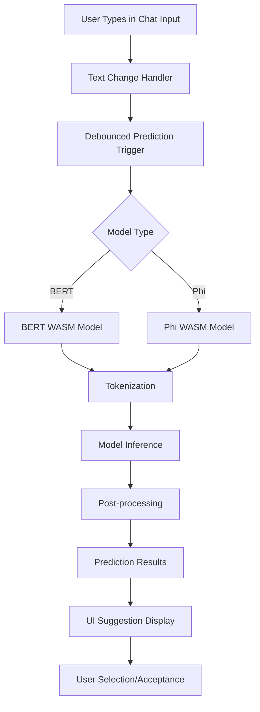
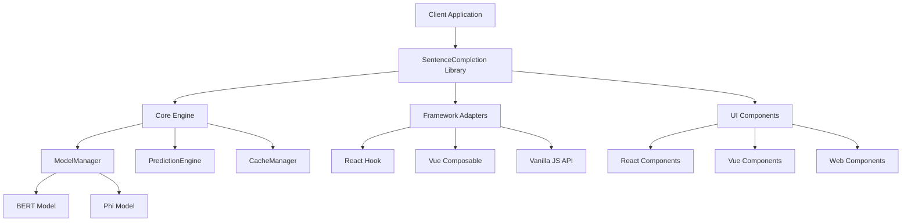

# Sentence Completion Library Architecture

## Overview

This document outlines the architecture for implementing a reusable sentence completion (next word prediction) library using client-side LLM models. The library will provide real-time word suggestions for any text input, making it suitable for integration across multiple projects including Next.js, React, Vue, and vanilla JavaScript applications.

## Table of Contents

1. [Architecture Overview](#architecture-overview)
2. [Library Design Principles](#library-design-principles)
3. [Model Comparison: BERT vs Phi](#model-comparison-bert-vs-phi)
4. [WASM Integration Strategy](#wasm-integration-strategy)
5. [Library API Design](#library-api-design)
6. [Implementation Plan](#implementation-plan)
7. [Technical Specifications](#technical-specifications)
8. [Performance Considerations](#performance-considerations)
9. [Security & Privacy](#security--privacy)
10. [Testing Strategy](#testing-strategy)
11. [Distribution & Packaging](#distribution--packaging)

## Architecture Overview

### High-Level Architecture



### Library Architecture



### Library Structure

```
sentence-completion-lib/
├── packages/
│   ├── core/                    # Core prediction engine
│   │   ├── src/
│   │   │   ├── models/
│   │   │   ├── prediction/
│   │   │   ├── cache/
│   │   │   └── types/
│   │   └── dist/
│   ├── react/                   # React integration
│   │   ├── src/
│   │   │   ├── hooks/
│   │   │   ├── components/
│   │   │   └── types/
│   │   └── dist/
│   ├── vue/                     # Vue integration
│   │   ├── src/
│   │   │   ├── composables/
│   │   │   ├── components/
│   │   │   └── types/
│   │   └── dist/
│   └── vanilla/                 # Vanilla JS API
│       ├── src/
│       └── dist/
├── examples/                    # Usage examples
│   ├── nextjs/
│   ├── react/
│   ├── vue/
│   └── vanilla/
├── docs/                        # Documentation
└── tests/                       # Test suites
```

## Library Design Principles

### 1. Framework Agnostic Core
- **Core engine** works independently of any framework
- **Framework adapters** provide framework-specific integrations
- **Modular design** allows using only needed components

### 2. Progressive Enhancement
- **Graceful degradation** when models fail to load
- **Optional features** that can be enabled/disabled
- **Fallback mechanisms** for unsupported environments

### 3. Performance First
- **Lazy loading** of models and features
- **Efficient caching** strategies
- **Minimal bundle impact** with tree-shaking support

### 4. Developer Experience
- **TypeScript support** with comprehensive type definitions
- **Simple API** with sensible defaults
- **Extensive documentation** and examples
- **Easy configuration** with minimal setup

### 5. Privacy & Security
- **Client-side only** processing
- **No external dependencies** for core functionality
- **Configurable privacy** settings
- **Secure model loading** and execution

### 6. Extensibility
- **Plugin architecture** for custom models
- **Customizable UI** components
- **Event system** for integration hooks
- **Configuration system** for advanced use cases

## Model Comparison: BERT vs Phi

### BERT (Bidirectional Encoder Representations from Transformers)

**Advantages:**
- **Mature Ecosystem**: Extensive pre-trained models and fine-tuning capabilities
- **Bidirectional Context**: Understands context from both directions
- **Proven Performance**: Well-established in NLP tasks
- **WASM Support**: Good support through Transformers.js and ONNX.js
- **Model Size**: Various sizes available (BERT-base: ~110M parameters, BERT-large: ~340M parameters)

**Disadvantages:**
- **Autoregressive Limitation**: Not originally designed for text generation
- **Context Window**: Limited context length (typically 512 tokens)
- **Performance**: Slower inference compared to newer models
- **Memory Usage**: Higher memory footprint

**Best Use Cases:**
- Context-aware completions
- Domain-specific fine-tuning
- When bidirectional understanding is crucial

### Phi Models (Microsoft's Compact Language Models)

**Advantages:**
- **Efficiency**: Designed for fast inference with smaller model sizes
- **Performance**: Optimized for speed and memory efficiency
- **Modern Architecture**: Built with recent advances in transformer design
- **WASM Friendly**: Better suited for browser deployment
- **Context Length**: Better handling of longer contexts
- **Text Generation**: Native autoregressive capabilities

**Disadvantages:**
- **Newer Technology**: Less mature ecosystem compared to BERT
- **Limited Pre-trained Models**: Fewer available model variants
- **Documentation**: Less comprehensive documentation and examples
- **Community Support**: Smaller community compared to BERT

**Best Use Cases:**
- Real-time text completion
- Mobile and resource-constrained environments
- When speed is prioritized over maximum accuracy

### Recommendation

**Primary Choice: Phi Models**
- Better suited for real-time text completion
- More efficient for browser deployment
- Native autoregressive capabilities
- Better performance-to-size ratio

**Fallback: BERT**
- If Phi models prove insufficient
- For domain-specific fine-tuning requirements
- When bidirectional context is critical

## WASM Integration Strategy

### Why WASM?

1. **Performance**: Near-native execution speed
2. **Security**: Sandboxed execution environment
3. **Portability**: Works across all modern browsers
4. **Memory Management**: Efficient memory usage
5. **No Server Dependency**: Complete client-side execution

### WASM Implementation Options

#### Option 1: ONNX.js with WASM Backend
```typescript
import { InferenceSession } from 'onnxruntime-web';

const session = await InferenceSession.create('model.onnx', {
  executionProviders: ['wasm']
});
```

**Pros:**
- Mature ecosystem
- Good performance
- Extensive model support
- Active development

**Cons:**
- Larger bundle size
- Complex setup for some models

#### Option 2: Transformers.js
```typescript
import { pipeline } from '@xenova/transformers';

const generator = await pipeline('text-generation', 'Xenova/phi-2');
```

**Pros:**
- Easy to use
- Built-in model management
- Good documentation
- Optimized for web

**Cons:**
- Limited model selection
- Less control over optimization

#### Option 3: Custom WASM Build
```typescript
// Custom WASM module for specific optimizations
import { ModelRunner } from './wasm/model-runner';
```

**Pros:**
- Maximum optimization
- Full control
- Minimal bundle size
- Custom features

**Cons:**
- Complex development
- Maintenance overhead
- Limited portability

### Recommended Approach: Hybrid Strategy

1. **Primary**: Transformers.js for rapid prototyping
2. **Production**: Custom WASM build for optimization
3. **Fallback**: ONNX.js for complex models

## Library API Design

### Core API (Framework Agnostic)

```typescript
// Core types
interface SentenceCompletionConfig {
  model?: ModelConfig;
  debounceMs?: number;
  maxSuggestions?: number;
  enableCache?: boolean;
  contextAware?: boolean;
  onError?: (error: Error) => void;
  onModelLoad?: (model: ModelInfo) => void;
}

interface ModelConfig {
  name: string;
  type: 'bert' | 'phi' | 'custom';
  path: string;
  maxContextLength?: number;
  quantized?: boolean;
  customLoader?: ModelLoader;
}

interface PredictionResult {
  suggestions: string[];
  confidence: number[];
  tokens: string[];
  processingTime: number;
  model: string;
}

// Core API
class SentenceCompletion {
  constructor(config?: SentenceCompletionConfig);
  
  async initialize(): Promise<void>;
  async predict(text: string): Promise<PredictionResult>;
  async loadModel(modelConfig: ModelConfig): Promise<void>;
  clearCache(): void;
  destroy(): void;
  
  // Events
  on(event: string, callback: Function): void;
  off(event: string, callback: Function): void;
}

// Factory function
export function createSentenceCompletion(config?: SentenceCompletionConfig): SentenceCompletion;
```

### React Integration

```typescript
// React Hook
interface UseSentenceCompletionOptions extends SentenceCompletionConfig {
  enabled?: boolean;
  onSuggestionSelect?: (suggestion: string) => void;
}

interface UseSentenceCompletionReturn {
  suggestions: string[];
  isLoading: boolean;
  error: string | null;
  isReady: boolean;
  acceptSuggestion: (suggestion: string) => void;
  clearSuggestions: () => void;
  updateText: (text: string) => void;
}

export function useSentenceCompletion(
  options?: UseSentenceCompletionOptions
): UseSentenceCompletionReturn;

// React Components
interface SuggestionDropdownProps {
  suggestions: string[];
  onSelect: (suggestion: string) => void;
  onClose: () => void;
  position?: { x: number; y: number };
  maxHeight?: number;
  className?: string;
}

export function SuggestionDropdown(props: SuggestionDropdownProps): JSX.Element;

interface TextInputWithCompletionProps {
  value: string;
  onChange: (value: string) => void;
  onSuggestionSelect?: (suggestion: string) => void;
  placeholder?: string;
  className?: string;
  disabled?: boolean;
  completionConfig?: UseSentenceCompletionOptions;
}

export function TextInputWithCompletion(props: TextInputWithCompletionProps): JSX.Element;
```

### Vue Integration

```typescript
// Vue Composable
interface UseSentenceCompletionOptions extends SentenceCompletionConfig {
  enabled?: Ref<boolean>;
  onSuggestionSelect?: (suggestion: string) => void;
}

interface UseSentenceCompletionReturn {
  suggestions: Ref<string[]>;
  isLoading: Ref<boolean>;
  error: Ref<string | null>;
  isReady: Ref<boolean>;
  acceptSuggestion: (suggestion: string) => void;
  clearSuggestions: () => void;
  updateText: (text: string) => void;
}

export function useSentenceCompletion(
  options?: UseSentenceCompletionOptions
): UseSentenceCompletionReturn;

// Vue Components
export const SuggestionDropdown: DefineComponent<SuggestionDropdownProps>;
export const TextInputWithCompletion: DefineComponent<TextInputWithCompletionProps>;
```

### Vanilla JavaScript API

```typescript
// Vanilla JS API
interface VanillaSentenceCompletionOptions extends SentenceCompletionConfig {
  inputElement: HTMLElement;
  suggestionContainer?: HTMLElement;
  onSuggestionSelect?: (suggestion: string) => void;
  onSuggestionShow?: (suggestions: string[]) => void;
  onSuggestionHide?: () => void;
}

class VanillaSentenceCompletion {
  constructor(options: VanillaSentenceCompletionOptions);
  
  async initialize(): Promise<void>;
  destroy(): void;
  updateInputElement(element: HTMLElement): void;
  showSuggestions(suggestions: string[]): void;
  hideSuggestions(): void;
}

// Factory function
export function createVanillaSentenceCompletion(
  options: VanillaSentenceCompletionOptions
): VanillaSentenceCompletion;
```

### Usage Examples

#### React Usage
```typescript
import { useSentenceCompletion, TextInputWithCompletion } from '@sentence-completion/react';

function ChatInput() {
  const { suggestions, isLoading, acceptSuggestion } = useSentenceCompletion({
    model: { name: 'phi-2', type: 'phi', path: '/models/phi-2' },
    maxSuggestions: 5,
    debounceMs: 300
  });

  return (
    <TextInputWithCompletion
      value={message}
      onChange={setMessage}
      onSuggestionSelect={acceptSuggestion}
      completionConfig={{ maxSuggestions: 5 }}
    />
  );
}
```

#### Vue Usage
```typescript
import { useSentenceCompletion } from '@sentence-completion/vue';

export default {
  setup() {
    const { suggestions, isLoading, acceptSuggestion } = useSentenceCompletion({
      model: { name: 'phi-2', type: 'phi', path: '/models/phi-2' },
      maxSuggestions: 5
    });

    return { suggestions, isLoading, acceptSuggestion };
  }
};
```

#### Vanilla JavaScript Usage
```typescript
import { createVanillaSentenceCompletion } from '@sentence-completion/vanilla';

const completion = createVanillaSentenceCompletion({
  inputElement: document.getElementById('message-input'),
  model: { name: 'phi-2', type: 'phi', path: '/models/phi-2' },
  onSuggestionSelect: (suggestion) => {
    console.log('Selected:', suggestion);
  }
});

await completion.initialize();
```

## Implementation Plan

### Phase 1: Core Library Foundation (Weeks 1-2)

#### 1.1 Library Project Setup
- [ ] Set up monorepo structure with Lerna/Nx
- [ ] Configure TypeScript for all packages
- [ ] Set up build system (Rollup/Webpack)
- [ ] Create package.json for each package
- [ ] Set up testing infrastructure (Jest/Vitest)

#### 1.2 Core Engine Development
- [ ] Implement core SentenceCompletion class
- [ ] Create ModelManager for BERT/Phi models
- [ ] Implement Transformers.js integration
- [ ] Create prediction pipeline
- [ ] Add caching system
- [ ] Implement error handling

#### 1.3 Basic API Design
- [ ] Define TypeScript interfaces
- [ ] Create factory functions
- [ ] Implement event system
- [ ] Add configuration management
- [ ] Create model loading utilities

### Phase 2: Framework Integrations (Weeks 3-4)

#### 2.1 React Integration
- [ ] Create React hook (useSentenceCompletion)
- [ ] Implement React components
- [ ] Add TypeScript definitions
- [ ] Create React-specific examples
- [ ] Test React integration

#### 2.2 Vue Integration
- [ ] Create Vue composable
- [ ] Implement Vue components
- [ ] Add Vue-specific types
- [ ] Create Vue examples
- [ ] Test Vue integration

#### 2.3 Vanilla JavaScript API
- [ ] Create vanilla JS wrapper
- [ ] Implement DOM integration
- [ ] Add event handling
- [ ] Create vanilla examples
- [ ] Test vanilla integration

### Phase 3: Advanced Features & Optimization (Weeks 5-6)

#### 3.1 Model Support & Comparison
- [ ] Implement BERT model integration
- [ ] Create model switching mechanism
- [ ] Add performance benchmarking
- [ ] Implement model comparison tools
- [ ] Add custom model support

#### 3.2 Performance Optimization
- [ ] Implement model quantization
- [ ] Add prediction batching
- [ ] Create memory management
- [ ] Optimize WASM loading
- [ ] Add progressive loading

#### 3.3 Advanced Features
- [ ] Add context awareness
- [ ] Implement suggestion confidence indicators
- [ ] Create suggestion history
- [ ] Add customization options
- [ ] Implement plugin system

### Phase 4: Production Ready & Distribution (Weeks 7-8)

#### 4.1 Testing & Quality Assurance
- [ ] Implement comprehensive testing suite
- [ ] Add performance benchmarks
- [ ] Create integration tests for all frameworks
- [ ] Add error tracking and monitoring
- [ ] Implement CI/CD pipeline

#### 4.2 Documentation & Examples
- [ ] Create comprehensive API documentation
- [ ] Add framework-specific guides
- [ ] Create interactive examples
- [ ] Add migration guides
- [ ] Create troubleshooting guides

#### 4.3 Distribution & Packaging
- [ ] Set up NPM publishing
- [ ] Create CDN distribution
- [ ] Add bundle size optimization
- [ ] Implement version management
- [ ] Create release automation

## Technical Specifications

### Package Dependencies

#### Core Package
```json
{
  "name": "@sentence-completion/core",
  "dependencies": {
    "@xenova/transformers": "^2.6.0",
    "onnxruntime-web": "^1.16.0",
    "comlink": "^4.4.1",
    "lodash.debounce": "^4.0.8"
  },
  "devDependencies": {
    "@types/lodash.debounce": "^4.0.7",
    "typescript": "^5.0.0",
    "rollup": "^4.0.0"
  }
}
```

#### React Package
```json
{
  "name": "@sentence-completion/react",
  "dependencies": {
    "@sentence-completion/core": "workspace:*",
    "react": "^18.0.0"
  },
  "peerDependencies": {
    "react": ">=16.8.0"
  }
}
```

#### Vue Package
```json
{
  "name": "@sentence-completion/vue",
  "dependencies": {
    "@sentence-completion/core": "workspace:*",
    "vue": "^3.0.0"
  },
  "peerDependencies": {
    "vue": ">=3.0.0"
  }
}
```

### Library Structure

```
sentence-completion-lib/
├── packages/
│   ├── core/                           # Core prediction engine
│   │   ├── src/
│   │   │   ├── models/
│   │   │   │   ├── ModelManager.ts
│   │   │   │   ├── BertModel.ts
│   │   │   │   ├── PhiModel.ts
│   │   │   │   └── types.ts
│   │   │   ├── prediction/
│   │   │   │   ├── PredictionEngine.ts
│   │   │   │   ├── Tokenizer.ts
│   │   │   │   └── PostProcessor.ts
│   │   │   ├── cache/
│   │   │   │   ├── CacheManager.ts
│   │   │   │   └── types.ts
│   │   │   ├── wasm/
│   │   │   │   ├── ModelLoader.ts
│   │   │   │   └── InferenceRunner.ts
│   │   │   ├── SentenceCompletion.ts
│   │   │   └── index.ts
│   │   ├── dist/
│   │   ├── package.json
│   │   └── tsconfig.json
│   ├── react/                          # React integration
│   │   ├── src/
│   │   │   ├── hooks/
│   │   │   │   └── useSentenceCompletion.ts
│   │   │   ├── components/
│   │   │   │   ├── SuggestionDropdown.tsx
│   │   │   │   ├── TextInputWithCompletion.tsx
│   │   │   │   └── types.ts
│   │   │   └── index.ts
│   │   ├── dist/
│   │   ├── package.json
│   │   └── tsconfig.json
│   ├── vue/                            # Vue integration
│   │   ├── src/
│   │   │   ├── composables/
│   │   │   │   └── useSentenceCompletion.ts
│   │   │   ├── components/
│   │   │   │   ├── SuggestionDropdown.vue
│   │   │   │   ├── TextInputWithCompletion.vue
│   │   │   │   └── types.ts
│   │   │   └── index.ts
│   │   ├── dist/
│   │   ├── package.json
│   │   └── tsconfig.json
│   └── vanilla/                        # Vanilla JS API
│       ├── src/
│       │   ├── VanillaSentenceCompletion.ts
│       │   ├── DOMIntegration.ts
│       │   └── index.ts
│       ├── dist/
│       ├── package.json
│       └── tsconfig.json
├── examples/                           # Usage examples
│   ├── nextjs/
│   ├── react/
│   ├── vue/
│   └── vanilla/
├── docs/                               # Documentation
│   ├── api/
│   ├── guides/
│   └── examples/
├── tests/                              # Test suites
│   ├── unit/
│   ├── integration/
│   └── e2e/
├── package.json                        # Root package.json
├── lerna.json                          # Monorepo configuration
└── tsconfig.json                       # Root TypeScript config
```

### API Design

```typescript
// Core interfaces
interface PredictionRequest {
  text: string;
  maxLength?: number;
  temperature?: number;
  topK?: number;
  topP?: number;
}

interface PredictionResult {
  suggestions: string[];
  confidence: number[];
  tokens: string[];
  processingTime: number;
}

interface ModelConfig {
  name: string;
  path: string;
  type: 'bert' | 'phi';
  maxContextLength: number;
  quantized: boolean;
}

// Hook interface
interface UseSentenceCompletionOptions {
  model: ModelConfig;
  debounceMs?: number;
  maxSuggestions?: number;
  enableCache?: boolean;
  contextAware?: boolean;
}

interface UseSentenceCompletionReturn {
  suggestions: string[];
  isLoading: boolean;
  error: string | null;
  acceptSuggestion: (suggestion: string) => void;
  clearSuggestions: () => void;
}
```

## Performance Considerations

### Model Loading Strategy

1. **Lazy Loading**: Load models only when needed
2. **Progressive Loading**: Load model in chunks
3. **Caching**: Cache loaded models in IndexedDB
4. **Compression**: Use quantized models when possible

### Inference Optimization

1. **Debouncing**: Prevent excessive predictions
2. **Batching**: Process multiple predictions together
3. **Caching**: Cache recent predictions
4. **Worker Threads**: Use Web Workers for inference

### Memory Management

1. **Model Cleanup**: Unload unused models
2. **Memory Monitoring**: Track memory usage
3. **Garbage Collection**: Force GC when needed
4. **Resource Limits**: Set memory limits

### Performance Targets

- **Model Loading**: < 3 seconds for initial load
- **Prediction Latency**: < 100ms for suggestions
- **Memory Usage**: < 200MB for model + inference
- **Bundle Size**: < 50MB additional for models

## Security & Privacy

### Data Privacy

1. **Local Processing**: All predictions happen client-side
2. **No Data Transmission**: No text sent to external servers
3. **Memory Cleanup**: Clear sensitive data from memory
4. **User Control**: Allow users to disable feature

### Security Measures

1. **WASM Sandboxing**: Models run in isolated environment
2. **Input Validation**: Sanitize all user inputs
3. **Error Handling**: Prevent information leakage
4. **Regular Updates**: Keep models and dependencies updated

## Testing Strategy

### Unit Testing

```typescript
// Example test structure
describe('SentenceCompletion', () => {
  describe('PredictionEngine', () => {
    it('should generate valid suggestions', async () => {
      const engine = new PredictionEngine();
      const result = await engine.predict('Hello world');
      expect(result.suggestions).toBeDefined();
      expect(result.suggestions.length).toBeGreaterThan(0);
    });
  });
});
```

### Integration Testing

1. **Model Loading**: Test model loading and initialization
2. **Prediction Pipeline**: Test end-to-end prediction flow
3. **UI Integration**: Test component integration
4. **Performance**: Test performance under load

### User Acceptance Testing

1. **Usability**: Test user experience and interface
2. **Performance**: Test on various devices and browsers
3. **Accessibility**: Test with screen readers and keyboard navigation
4. **Error Handling**: Test error scenarios and recovery

### Performance Testing

1. **Load Testing**: Test with various text lengths
2. **Memory Testing**: Monitor memory usage over time
3. **Speed Testing**: Measure prediction latency
4. **Stress Testing**: Test under high load conditions

## Distribution & Packaging

### NPM Packages

The library will be distributed as separate NPM packages:

```bash
# Core package
npm install @sentence-completion/core

# Framework-specific packages
npm install @sentence-completion/react
npm install @sentence-completion/vue
npm install @sentence-completion/vanilla

# Or install all at once
npm install @sentence-completion/all
```

### CDN Distribution

```html
<!-- Core library -->
<script src="https://cdn.jsdelivr.net/npm/@sentence-completion/core@latest/dist/index.umd.js"></script>

<!-- React integration -->
<script src="https://cdn.jsdelivr.net/npm/@sentence-completion/react@latest/dist/index.umd.js"></script>

<!-- Vue integration -->
<script src="https://cdn.jsdelivr.net/npm/@sentence-completion/vue@latest/dist/index.umd.js"></script>
```

### Bundle Size Optimization

- **Tree Shaking**: Support for tree shaking to include only used features
- **Code Splitting**: Dynamic imports for models and features
- **Compression**: Gzip/Brotli compression for CDN distribution
- **Minification**: Optimized production builds

### Version Management

- **Semantic Versioning**: Follow semver for all packages
- **Monorepo**: Single source of truth with coordinated releases
- **Changelog**: Comprehensive changelog for each release
- **Migration Guides**: Clear upgrade paths between versions

### Publishing Strategy

1. **Automated Releases**: CI/CD pipeline for automated publishing
2. **Beta Releases**: Pre-release versions for testing
3. **Stable Releases**: Production-ready versions
4. **LTS Support**: Long-term support for stable versions

## Conclusion

This architecture provides a comprehensive foundation for implementing a reusable sentence completion library. The modular, framework-agnostic design ensures broad compatibility while maintaining performance and developer experience.

### Key Benefits

1. **Reusability**: Can be used across multiple projects and frameworks
2. **Performance**: Optimized for speed with WASM integration
3. **Privacy**: Complete client-side processing
4. **Flexibility**: Support for multiple models and frameworks
5. **Developer Experience**: Simple APIs with comprehensive documentation

### Success Metrics

- **Adoption**: Number of projects using the library
- **Performance**: Prediction latency < 100ms
- **Bundle Size**: < 50MB additional for models
- **Compatibility**: Support for all major browsers and frameworks
- **Developer Satisfaction**: Positive feedback and contributions

## Next Steps

1. **Review and Approve**: Review this architecture with the development team
2. **Resource Allocation**: Assign developers and set timeline
3. **Environment Setup**: Prepare development and testing environments
4. **Model Selection**: Finalize model choices and obtain necessary licenses
5. **Library Setup**: Initialize monorepo structure and tooling
6. **Implementation Start**: Begin Phase 1 implementation

---

*Document Version: 2.0*  
*Last Updated: [Current Date]*  
*Author: AI Assistant*
