# Step-by-Step Reasoning Mechanism Design Guide

## Overview

Step-by-step reasoning mechanisms are essential for building AI systems that can solve complex problems systematically, explain their thinking process, and arrive at reliable conclusions. This guide provides a comprehensive framework for designing and implementing effective reasoning systems.

## Table of Contents

1. [Core Concepts](#core-concepts)
2. [Design Principles](#design-principles)
3. [Architecture Patterns](#architecture-patterns)
4. [Implementation Strategies](#implementation-strategies)
5. [Reasoning Frameworks](#reasoning-frameworks)
6. [Evaluation Methods](#evaluation-methods)
7. [Best Practices](#best-practices)
8. [Case Studies](#case-studies)
9. [Advanced Techniques](#advanced-techniques)
10. [Integration with RAG](#integration-with-rag)

## Core Concepts

### What is Step-by-Step Reasoning?

Step-by-step reasoning is a systematic approach where an AI system:

1. **Breaks down complex problems** into manageable sub-problems
2. **Explicitly states each step** of the reasoning process
3. **Validates intermediate conclusions** before proceeding
4. **Builds toward a final answer** through logical progression
5. **Provides transparency** in the decision-making process

This methodology transforms complex, opaque AI decision-making into a transparent, auditable process that humans can understand, validate, and trust. Unlike black-box AI systems that provide answers without explanation, step-by-step reasoning creates a clear trail of logical progression that can be examined, debugged, and improved.

**Why Step-by-Step Reasoning Matters:**

- **Trust and Transparency**: Users can see exactly how the AI arrived at its conclusion
- **Error Detection**: Intermediate steps make it easier to identify where reasoning went wrong
- **Learning and Improvement**: Understanding the reasoning process helps improve the system
- **Compliance**: Many industries require explainable AI for regulatory compliance
- **Debugging**: Step-by-step reasoning makes it easier to fix issues and optimize performance

**Comparison with Traditional AI Approaches:**

| Approach | Transparency | Debuggability | Trust | Complexity |
|----------|-------------|---------------|-------|------------|
| Black-box AI | Low | Difficult | Low | Simple |
| Rule-based Systems | High | Easy | High | Complex |
| Step-by-step Reasoning | High | Easy | High | Moderate |

### Key Components

<details>
<summary><strong>📋 Core Data Structures</strong></summary>

```python
class ReasoningStep:
    def __init__(self, step_id: int, description: str, reasoning: str, 
                 input_data: Any, output_data: Any, confidence: float):
        self.step_id = step_id
        self.description = description
        self.reasoning = reasoning
        self.input_data = input_data
        self.output_data = output_data
        self.confidence = confidence
        self.validation = None
        self.dependencies = []

class ReasoningChain:
    def __init__(self, problem: str, steps: List[ReasoningStep]):
        self.problem = problem
        self.steps = steps
        self.final_answer = None
        self.overall_confidence = 0.0
        self.execution_time = 0.0
```

</details>

### Reasoning System Architecture

The architecture of a step-by-step reasoning system consists of several interconnected components that work together to process problems systematically. Each component has a specific role in the reasoning pipeline, ensuring that complex problems are broken down, processed, and validated at each stage.

**Core Architecture Components:**

1. **Problem Input Handler**: Receives and preprocesses the initial problem statement
2. **Reasoning Engine**: Orchestrates the entire reasoning process
3. **Step Executor**: Manages individual reasoning steps
4. **Validation Framework**: Ensures correctness at each stage
5. **Knowledge Base**: Provides domain-specific information and rules
6. **Confidence Scoring**: Evaluates the reliability of each step
7. **Output Synthesizer**: Combines results into a final answer

**Data Flow Through the System:**

The system processes information through a structured pipeline where each step builds upon the previous one. This creates a chain of reasoning that can be traced, validated, and optimized. The architecture supports both linear and branching reasoning paths, allowing for complex problem-solving scenarios.


## Design Principles

The design principles for step-by-step reasoning systems provide a foundation for creating robust, maintainable, and effective reasoning engines. These principles guide both the architectural decisions and implementation choices throughout the development process.

### 1. **Modularity**
- Each reasoning step should be self-contained
- Steps should have clear inputs and outputs
- Dependencies between steps should be explicit

**Why Modularity Matters:**
Modular design enables easier testing, debugging, and maintenance. Each step can be developed, tested, and optimized independently. This also allows for better code reuse and the ability to swap out individual components without affecting the entire system.

**Implementation Considerations:**
- Define clear interfaces between steps
- Use dependency injection for step dependencies
- Implement step isolation to prevent side effects
- Create step templates for common patterns

### 2. **Transparency**
- Every step should be explainable
- Reasoning should be human-readable
- Confidence levels should be provided

**Transparency Benefits:**
Transparent reasoning builds user trust and enables better debugging. When users can understand how the system arrived at its conclusion, they're more likely to trust and use the system effectively.

**Transparency Techniques:**
- Provide detailed explanations for each step
- Include confidence scores and uncertainty measures
- Show the reasoning chain in a human-readable format
- Offer alternative reasoning paths when available

### 3. **Validation**
- Each step should validate its inputs
- Intermediate results should be checked
- Error handling should be graceful

**Validation Strategy:**
Robust validation ensures system reliability and helps catch errors early in the reasoning process. This prevents cascading failures and improves overall system performance.

**Validation Approaches:**
- Input type and range checking
- Logical consistency validation
- Cross-reference validation with knowledge base
- Confidence threshold enforcement

### 4. **Flexibility**
- Steps should be composable
- Different reasoning paths should be possible
- System should adapt to problem complexity

**Flexibility Advantages:**
A flexible system can handle diverse problem types and adapt to changing requirements. This makes the system more versatile and future-proof.

**Flexibility Implementation:**
- Dynamic step selection based on problem characteristics
- Configurable reasoning strategies
- Pluggable step components
- Adaptive reasoning paths

### 5. **Efficiency**
- Avoid redundant computations
- Cache intermediate results when appropriate
- Parallelize independent steps

**Efficiency Considerations:**
While transparency and validation are important, the system must also be efficient enough for practical use. Balancing these requirements is crucial for real-world deployment.

**Optimization Techniques:**
- Memoization of expensive computations
- Parallel execution of independent steps
- Early termination of invalid reasoning paths
- Resource-aware step execution

## Architecture Patterns

Architecture patterns provide structured approaches to organizing reasoning systems. Each pattern offers different trade-offs in terms of complexity, flexibility, and performance. Choosing the right pattern depends on the problem domain, complexity requirements, and system constraints.

### 1. **Linear Chain Pattern**

The linear chain pattern is the simplest and most straightforward approach to step-by-step reasoning. It processes problems through a predefined sequence of steps, where each step builds upon the results of the previous one.

**When to Use Linear Chains:**
- Problems with clear, sequential solution paths
- Well-understood domains with established procedures
- Situations where transparency and simplicity are priorities
- Educational or training scenarios where step-by-step explanation is important

**Advantages:**
- Simple to implement and understand
- Easy to debug and maintain
- Predictable execution flow
- Clear step dependencies

**Limitations:**
- Inflexible for complex, branching problems
- Cannot handle multiple solution paths
- May not be optimal for all problem types
- Limited adaptability to changing requirements

**Use Cases:**
- Mathematical problem solving
- Procedural task execution
- Data processing pipelines
- Educational tutoring systems

<details>
<summary><strong>🔗 Linear Chain Implementation</strong></summary>

```python
class LinearReasoningChain:
    def __init__(self, steps: List[ReasoningStep]):
        self.steps = steps
    
    def execute(self, initial_input: Any) -> ReasoningResult:
        current_input = initial_input
        results = []
        
        for step in self.steps:
            step_result = step.execute(current_input)
            results.append(step_result)
            current_input = step_result.output_data
            
            # Validate step result
            if not step_result.is_valid():
                return ReasoningResult(
                    success=False,
                    error=f"Step {step.step_id} failed: {step_result.error}",
                    partial_results=results
                )
        
        return ReasoningResult(
            success=True,
            final_answer=current_input,
            steps=results
        )
```

</details>


### 2. **Tree Pattern**

The tree pattern extends the linear chain by introducing branching logic that allows the system to explore multiple possible solution paths. This pattern is essential for problems where different approaches or conditions lead to different reasoning strategies.

**When to Use Tree Patterns:**
- Problems with multiple valid solution approaches
- Situations requiring conditional reasoning
- Complex decision-making scenarios
- Problems where different input conditions require different strategies

**Tree Structure Benefits:**
- **Flexibility**: Can handle multiple solution paths
- **Conditional Logic**: Supports complex decision trees
- **Exploration**: Can evaluate multiple approaches
- **Adaptability**: Can choose optimal paths based on conditions

**Tree Pattern Components:**
- **Root Node**: The initial problem or decision point
- **Decision Nodes**: Points where the reasoning branches based on conditions
- **Leaf Nodes**: Final outcomes or intermediate results
- **Branches**: The connections between nodes representing reasoning paths

**Implementation Considerations:**
- **Branching Strategy**: How to determine which branch to take
- **Path Evaluation**: How to assess the quality of different paths
- **Backtracking**: Whether to explore alternative paths if initial choices fail
- **Memory Management**: How to handle the exponential growth of possible paths

**Use Cases:**
- Medical diagnosis systems
- Financial decision making
- Game playing AI
- Troubleshooting systems
- Multi-step planning problems

<details>
<summary><strong>🌳 Tree Pattern Implementation</strong></summary>

```python
class TreeReasoningChain:
    def __init__(self, root_step: ReasoningStep):
        self.root = root_step
        self.branches = {}
    
    def add_branch(self, condition: Callable, steps: List[ReasoningStep]):
        self.branches[condition] = steps
    
    def execute(self, initial_input: Any) -> ReasoningResult:
        return self._execute_branch(self.root, initial_input, [])
    
    def _execute_branch(self, step: ReasoningStep, input_data: Any, 
                       path: List[ReasoningStep]) -> ReasoningResult:
        # Execute current step
        step_result = step.execute(input_data)
        path.append(step_result)
        
        # Check if we should branch
        for condition, branch_steps in self.branches.items():
            if condition(step_result):
                # Execute branch
                for branch_step in branch_steps:
                    branch_result = self._execute_branch(
                        branch_step, step_result.output_data, path
                    )
                    if not branch_result.success:
                        return branch_result
        
        return ReasoningResult(
            success=True,
            final_answer=step_result.output_data,
            steps=path
        )
```

</details>


### 3. **Graph Pattern**

The graph pattern represents the most complex and flexible architecture for step-by-step reasoning. It allows for arbitrary connections between reasoning steps, enabling the representation of complex interdependencies and multi-directional information flow.

**When to Use Graph Patterns:**
- Problems with complex interdependencies between components
- Situations requiring multi-directional information flow
- Systems with shared resources or constraints
- Problems where steps can influence each other in multiple ways

**Graph Pattern Advantages:**
- **Maximum Flexibility**: Can represent any relationship between steps
- **Complex Dependencies**: Handles intricate interdependencies
- **Parallel Processing**: Enables concurrent execution of independent steps
- **Resource Sharing**: Allows steps to share information and resources
- **Constraint Satisfaction**: Can handle complex constraint networks

**Graph Structure Components:**
- **Nodes**: Individual reasoning steps or decision points
- **Edges**: Dependencies, data flow, or logical connections
- **Cycles**: Feedback loops for iterative refinement
- **Clusters**: Groups of related steps that can be processed together

**Implementation Challenges:**
- **Topological Sorting**: Determining the correct execution order
- **Cycle Detection**: Identifying and handling feedback loops
- **Deadlock Prevention**: Avoiding circular dependencies
- **Performance Optimization**: Efficient traversal and execution
- **Memory Management**: Handling complex dependency graphs

**Use Cases:**
- Complex system modeling
- Multi-agent coordination
- Constraint satisfaction problems
- Scientific computing workflows
- Large-scale data processing
- Knowledge graph reasoning

<details>
<summary><strong>🕸️ Graph Pattern Implementation</strong></summary>

```python
class GraphReasoningChain:
    def __init__(self):
        self.nodes = {}
        self.edges = {}
        self.execution_order = []
    
    def add_node(self, node_id: str, step: ReasoningStep):
        self.nodes[node_id] = step
    
    def add_edge(self, from_node: str, to_node: str, condition: Callable = None):
        if from_node not in self.edges:
            self.edges[from_node] = []
        self.edges[from_node].append((to_node, condition))
    
    def execute(self, initial_inputs: Dict[str, Any]) -> ReasoningResult:
        # Topological sort to determine execution order
        self._compute_execution_order()
        
        # Execute in order
        results = {}
        for node_id in self.execution_order:
            step = self.nodes[node_id]
            
            # Gather inputs from dependencies
            inputs = self._gather_inputs(node_id, results, initial_inputs)
            
            # Execute step
            step_result = step.execute(inputs)
            results[node_id] = step_result
            
            if not step_result.is_valid():
                return ReasoningResult(
                    success=False,
                    error=f"Node {node_id} failed: {step_result.error}",
                    partial_results=results
                )
        
        return ReasoningResult(
            success=True,
            final_answer=results,
            steps=list(results.values())
        )
```

</details>


## Implementation Strategies

Implementation strategies provide practical approaches to building step-by-step reasoning systems. These strategies combine theoretical concepts with practical techniques to create effective reasoning engines that can handle real-world problems.

### 1. **Prompt Engineering for Reasoning**

Prompt engineering is the art and science of designing inputs that guide AI systems to produce desired outputs. For step-by-step reasoning, effective prompt engineering is crucial for encouraging systematic thinking and ensuring consistent, explainable results.

**Core Principles of Reasoning Prompts:**

**Structured Thinking**: Prompts should guide the AI to break down problems systematically rather than jumping to conclusions. This involves explicitly requesting step-by-step analysis and intermediate reasoning.

**Context Provision**: Providing relevant context helps the AI understand the problem domain and apply appropriate reasoning strategies. This includes domain-specific information, constraints, and relevant examples.

**Validation Requests**: Asking the AI to validate its own reasoning at each step helps catch errors and improves overall accuracy. This can include requests to check assumptions, verify calculations, or consider alternative approaches.

**Confidence Assessment**: Encouraging the AI to express confidence levels for each step helps users understand the reliability of the reasoning process and identify areas of uncertainty.

**Prompt Design Techniques:**

**Chain-of-Thought Formatting**: Using explicit formatting that encourages the AI to show its work, such as numbered steps, reasoning explanations, and intermediate results.

**Example-Driven Learning**: Including examples of good reasoning in the prompt helps the AI understand the expected format and quality of reasoning.

**Constraint Specification**: Clearly stating constraints, assumptions, and requirements helps the AI focus on relevant aspects of the problem.

**Iterative Refinement**: Designing prompts that allow for iterative improvement of reasoning, where the AI can refine its approach based on intermediate results.

**When to Use Prompt Engineering:**
- When working with large language models
- For rapid prototyping of reasoning systems
- When domain expertise is limited
- For educational or explanatory applications
- When human oversight is available for validation

<details>
<summary><strong>💬 Prompt Engineering Implementation</strong></summary>

```python
def create_reasoning_prompt(problem: str, context: str = "") -> str:
    return f"""
You are a logical reasoning system. Solve the following problem step by step:

Problem: {problem}
Context: {context}

Instructions:
1. Break down the problem into clear, logical steps
2. For each step, explain your reasoning
3. Validate your assumptions
4. Check your work at each stage
5. Provide a clear final answer

Format your response as:
Step 1: [Description]
Reasoning: [Your logical reasoning]
Result: [Intermediate result]

Step 2: [Description]
Reasoning: [Your logical reasoning]
Result: [Intermediate result]

...

Final Answer: [Your conclusion]
Confidence: [High/Medium/Low]
"""
```

</details>


### 2. **Chain-of-Thought (CoT) Implementation**

Chain-of-Thought (CoT) reasoning is a technique that encourages AI systems to generate intermediate reasoning steps before arriving at a final answer. This approach mimics human problem-solving processes and has been shown to significantly improve performance on complex reasoning tasks.

**Core Concepts of Chain-of-Thought:**

**Sequential Reasoning**: CoT breaks down complex problems into a sequence of simpler steps, where each step builds logically on the previous one. This sequential approach helps prevent errors and makes the reasoning process more transparent.

**Intermediate Outputs**: Unlike traditional approaches that jump directly to conclusions, CoT generates intermediate outputs that can be examined, validated, and refined. These intermediate outputs serve as checkpoints in the reasoning process.

**Natural Language Reasoning**: CoT typically uses natural language to express reasoning steps, making the process more accessible to humans and easier to understand and debug.

**Iterative Refinement**: The CoT approach allows for iterative refinement, where the system can revisit and improve earlier steps based on later insights.

**Advantages of Chain-of-Thought:**

**Improved Accuracy**: By breaking down complex problems into simpler steps, CoT reduces the likelihood of errors and improves overall accuracy.

**Enhanced Transparency**: The intermediate reasoning steps provide visibility into the AI's decision-making process, building trust and enabling better debugging.

**Better Generalization**: CoT helps AI systems generalize better to new problems by teaching them systematic problem-solving approaches.

**Educational Value**: The explicit reasoning steps can be valuable for educational purposes, helping users understand how to approach similar problems.

**Implementation Considerations:**

**Step Granularity**: Determining the appropriate level of detail for each reasoning step is crucial. Steps that are too coarse may miss important details, while steps that are too fine may become tedious.

**Validation Mechanisms**: Implementing validation at each step helps catch errors early and ensures the reasoning process remains on track.

**Confidence Scoring**: Assigning confidence levels to each step helps identify areas of uncertainty and guides further investigation.

**Fallback Strategies**: Having fallback strategies for when CoT reasoning fails or produces low-confidence results is important for robust system operation.

<details>
<summary><strong>🧠 Chain-of-Thought Implementation</strong></summary>

```python
class ChainOfThoughtReasoner:
    def __init__(self, llm_client):
        self.llm = llm_client
        self.max_steps = 10
        self.confidence_threshold = 0.7
    
    def reason(self, problem: str) -> ReasoningResult:
        steps = []
        current_context = problem
        
        for step_num in range(self.max_steps):
            # Generate next reasoning step
            step_prompt = self._create_step_prompt(current_context, step_num + 1)
            step_response = self.llm.generate(step_prompt)
            
            # Parse step
            step = self._parse_reasoning_step(step_response, step_num + 1)
            steps.append(step)
            
            # Check if we've reached a conclusion
            if step.is_final_answer():
                break
            
            # Update context for next step
            current_context = self._update_context(current_context, step)
        
        return ReasoningResult(
            success=True,
            final_answer=steps[-1].output_data if steps else None,
            steps=steps
        )
    
    def _create_step_prompt(self, context: str, step_num: int) -> str:
        return f"""
Given the current context:
{context}

Generate step {step_num} of the reasoning process:

1. What is the next logical step?
2. What information do you need?
3. What is your reasoning?
4. What is the result of this step?

Format:
Step {step_num}: [Description]
Reasoning: [Your logic]
Result: [Output]
"""
```

</details>


### 3. **Tree-of-Thoughts (ToT) Implementation**

Tree-of-Thoughts (ToT) extends the Chain-of-Thought approach by exploring multiple reasoning paths simultaneously. Instead of following a single linear chain of reasoning, ToT generates a tree of possible reasoning steps and uses search algorithms to find the best path to a solution.

**Core Concepts of Tree-of-Thoughts:**

**Multi-Path Exploration**: ToT generates multiple possible next steps at each reasoning point, creating a tree of alternative reasoning paths. This allows the system to explore different approaches and strategies.

**Search-Based Selection**: Rather than following a predetermined path, ToT uses search algorithms to evaluate and select the most promising reasoning paths. This can include breadth-first search, depth-first search, or more sophisticated search strategies.

**Backtracking and Refinement**: ToT can backtrack from unsuccessful paths and explore alternatives, allowing for more robust problem-solving and better handling of complex, multi-step problems.

**Evaluation and Scoring**: Each reasoning path is evaluated and scored based on various criteria, such as logical consistency, completeness, and likelihood of leading to a correct solution.

**Advantages of Tree-of-Thoughts:**

**Better Problem Coverage**: By exploring multiple paths, ToT can handle problems that have multiple valid solution approaches or require exploration of different strategies.

**Robustness**: The ability to backtrack and explore alternatives makes ToT more robust when dealing with complex problems where the optimal path is not immediately obvious.

**Optimal Solution Finding**: Search algorithms can help ToT find optimal or near-optimal solutions by evaluating multiple approaches and selecting the best one.

**Handling Uncertainty**: ToT can better handle problems with uncertainty by exploring multiple possible interpretations or approaches.

**Implementation Challenges:**

**Computational Complexity**: Exploring multiple paths increases computational requirements, requiring careful management of search space and computational resources.

**Evaluation Criteria**: Defining effective evaluation criteria for comparing different reasoning paths is crucial for the success of ToT approaches.

**Memory Management**: Managing the memory requirements for storing and exploring multiple reasoning paths can be challenging for complex problems.

**Search Strategy Selection**: Choosing appropriate search strategies for different problem types requires careful consideration and experimentation.

**When to Use Tree-of-Thoughts:**
- Complex problems with multiple valid approaches
- Situations requiring exploration of different strategies
- Problems where the optimal path is not obvious
- Cases where robustness and thoroughness are priorities
- Research and development scenarios where exploring alternatives is valuable

<details>
<summary><strong>🌳 Tree-of-Thoughts Implementation</strong></summary>

```python
class TreeOfThoughtsReasoner:
    def __init__(self, llm_client, max_breadth=3, max_depth=5):
        self.llm = llm_client
        self.max_breadth = max_breadth
        self.max_depth = max_depth
    
    def reason(self, problem: str) -> ReasoningResult:
        root_node = ReasoningNode(problem, depth=0)
        best_path = self._search_tree(root_node)
        
        return ReasoningResult(
            success=True,
            final_answer=best_path.final_answer,
            steps=best_path.steps
        )
    
    def _search_tree(self, node: ReasoningNode) -> ReasoningPath:
        if node.depth >= self.max_depth:
            return self._evaluate_leaf(node)
        
        # Generate possible next steps
        candidates = self._generate_candidates(node)
        
        # Evaluate each candidate
        best_candidate = None
        best_score = float('-inf')
        
        for candidate in candidates[:self.max_breadth]:
            candidate_node = ReasoningNode(
                candidate, 
                parent=node, 
                depth=node.depth + 1
            )
            
            # Recursively search from this candidate
            path = self._search_tree(candidate_node)
            
            if path.score > best_score:
                best_score = path.score
                best_candidate = path
        
        return best_candidate or self._evaluate_leaf(node)
    
    def _generate_candidates(self, node: ReasoningNode) -> List[str]:
        prompt = f"""
Given the current reasoning state:
{node.content}

Generate {self.max_breadth} different possible next steps in the reasoning process.
Each step should be a logical continuation of the current thinking.

Format as a numbered list:
1. [First possible step]
2. [Second possible step]
3. [Third possible step]
"""
        
        response = self.llm.generate(prompt)
        return self._parse_candidates(response)
```

</details>


## Reasoning Frameworks

Reasoning frameworks provide specialized approaches for different types of problems and domains. Each framework is designed to handle specific problem characteristics and leverage domain-specific knowledge and techniques.

### 1. **Mathematical Reasoning**

Mathematical reasoning frameworks are designed to handle problems that involve numerical calculations, symbolic manipulation, and mathematical logic. These frameworks combine formal mathematical techniques with step-by-step reasoning to ensure accuracy and provide clear explanations.

**Core Components of Mathematical Reasoning:**

**Symbolic Manipulation**: The ability to work with mathematical symbols, equations, and expressions in a formal way. This includes algebraic manipulation, calculus operations, and symbolic logic.

**Numerical Computation**: Handling numerical calculations with appropriate precision and error handling. This includes arithmetic operations, statistical calculations, and numerical optimization.

**Proof Techniques**: Applying mathematical proof techniques such as induction, contradiction, and direct proof to establish the validity of mathematical statements.

**Problem Classification**: Automatically identifying the type of mathematical problem (algebraic, geometric, calculus, etc.) and applying appropriate solution strategies.

**Mathematical Reasoning Capabilities:**

**Algebraic Problem Solving**: Solving equations, systems of equations, and algebraic expressions using formal algebraic techniques.

**Geometric Reasoning**: Working with geometric shapes, spatial relationships, and geometric proofs using geometric principles and theorems.

**Calculus Operations**: Performing differentiation, integration, and limit calculations with appropriate mathematical rigor.

**Statistical Analysis**: Conducting statistical calculations, probability analysis, and data interpretation using statistical methods.

**Implementation Considerations:**

**Precision and Accuracy**: Mathematical reasoning requires high precision and accuracy, with careful attention to numerical errors and approximation methods.

**Symbolic vs. Numerical**: Choosing between symbolic and numerical approaches based on problem requirements and computational constraints.

**Error Handling**: Implementing robust error handling for mathematical operations, including division by zero, undefined operations, and numerical overflow.

**Validation**: Using mathematical properties and relationships to validate results and catch computational errors.

**Use Cases:**
- Engineering calculations and design
- Scientific computing and research
- Financial modeling and analysis
- Educational mathematics tutoring
- Data analysis and statistics
- Optimization problems

<details>
<summary><strong>🔢 Mathematical Reasoning Implementation</strong></summary>

```python
class MathematicalReasoner:
    def __init__(self):
        self.symbolic_solver = None  # e.g., SymPy
        self.numerical_solver = None  # e.g., NumPy
    
    def solve_problem(self, problem: str) -> ReasoningResult:
        # Step 1: Parse the problem
        parsed = self._parse_mathematical_problem(problem)
        
        # Step 2: Identify problem type
        problem_type = self._classify_problem(parsed)
        
        # Step 3: Choose appropriate solving strategy
        strategy = self._select_strategy(problem_type)
        
        # Step 4: Execute solution
        solution = strategy.solve(parsed)
        
        # Step 5: Verify solution
        verification = self._verify_solution(parsed, solution)
        
        return ReasoningResult(
            success=verification.is_valid,
            final_answer=solution,
            steps=[
                ReasoningStep(1, "Parse problem", "Extract mathematical expressions", problem, parsed, 0.9),
                ReasoningStep(2, "Classify problem", f"Identified as {problem_type}", parsed, problem_type, 0.8),
                ReasoningStep(3, "Select strategy", f"Using {strategy.name}", problem_type, strategy, 0.9),
                ReasoningStep(4, "Solve", "Execute solution algorithm", strategy, solution, 0.95),
                ReasoningStep(5, "Verify", "Check solution correctness", solution, verification, 0.9)
            ]
        )
```

</details>


### 2. **Logical Reasoning**

Logical reasoning frameworks focus on problems that involve formal logic, deductive reasoning, and logical inference. These frameworks use formal logical systems to ensure sound reasoning and provide rigorous proofs of conclusions.

**Core Components of Logical Reasoning:**

**Propositional Logic**: Working with simple logical statements and their combinations using logical operators (AND, OR, NOT, IMPLIES, etc.).

**Predicate Logic**: Handling more complex logical statements involving quantifiers (FOR ALL, EXISTS) and predicates that can be applied to objects.

**Logical Inference Rules**: Applying formal rules of inference such as modus ponens, modus tollens, and syllogistic reasoning to derive conclusions from premises.

**Consistency Checking**: Verifying that sets of logical statements are consistent and don't contain contradictions.

**Logical Reasoning Capabilities:**

**Deductive Reasoning**: Drawing specific conclusions from general principles using logical inference rules.

**Syllogistic Reasoning**: Applying classical syllogistic logic to derive conclusions from categorical premises.

**Conditional Logic**: Working with if-then statements and understanding their logical implications.

**Set Theory Operations**: Applying set theory concepts and operations to logical problems.

**Implementation Considerations:**

**Formal Language**: Using precise formal language to represent logical statements and avoid ambiguity.

**Inference Engine**: Implementing efficient algorithms for logical inference and theorem proving.

**Consistency Maintenance**: Ensuring that logical knowledge bases remain consistent as new information is added.

**Proof Generation**: Generating formal proofs that demonstrate the validity of logical conclusions.

**Use Cases:**
- Automated theorem proving
- Expert systems and knowledge bases
- Legal reasoning and compliance checking
- Software verification and formal methods
- Philosophical and mathematical logic
- Decision support systems

<details>
<summary><strong>🔍 Logical Reasoning Implementation</strong></summary>

```python
class LogicalReasoner:
    def __init__(self):
        self.logic_engine = None  # e.g., Prolog or custom logic engine
    
    def solve_problem(self, problem: str) -> ReasoningResult:
        # Step 1: Extract logical statements
        statements = self._extract_statements(problem)
        
        # Step 2: Build knowledge base
        knowledge_base = self._build_knowledge_base(statements)
        
        # Step 3: Apply logical rules
        conclusions = self._apply_logical_rules(knowledge_base)
        
        # Step 4: Check consistency
        consistency = self._check_consistency(conclusions)
        
        # Step 5: Generate final answer
        final_answer = self._synthesize_answer(conclusions)
        
        return ReasoningResult(
            success=consistency.is_consistent,
            final_answer=final_answer,
            steps=[
                ReasoningStep(1, "Extract statements", "Parse logical propositions", problem, statements, 0.9),
                ReasoningStep(2, "Build knowledge base", "Organize logical facts", statements, knowledge_base, 0.8),
                ReasoningStep(3, "Apply rules", "Use logical inference rules", knowledge_base, conclusions, 0.85),
                ReasoningStep(4, "Check consistency", "Verify logical consistency", conclusions, consistency, 0.9),
                ReasoningStep(5, "Synthesize answer", "Generate final conclusion", consistency, final_answer, 0.8)
            ]
        )
```

</details>


### 3. **Causal Reasoning**

Causal reasoning frameworks focus on understanding cause-and-effect relationships and making predictions about how changes in one variable affect others. These frameworks are essential for problems involving intervention, prediction, and explanation of complex systems.

**Core Components of Causal Reasoning:**

**Causal Graph Construction**: Building directed acyclic graphs (DAGs) that represent causal relationships between variables, where edges indicate direct causal influences.

**Causal Identification**: Determining which causal effects can be estimated from available data and which require additional assumptions or experimental data.

**Intervention Analysis**: Understanding how intervening on one variable affects other variables in the system, often using the do-calculus framework.

**Counterfactual Reasoning**: Reasoning about what would have happened under different conditions or interventions.

**Causal Reasoning Capabilities:**

**Causal Discovery**: Automatically discovering causal relationships from observational data using statistical and machine learning techniques.

**Effect Estimation**: Estimating the magnitude and direction of causal effects between variables.

**Mediation Analysis**: Understanding how causal effects are transmitted through intermediate variables.

**Confounding Control**: Identifying and controlling for confounding variables that might bias causal estimates.

**Implementation Considerations:**

**Causal Assumptions**: Making explicit assumptions about causal relationships and their validity in the specific context.

**Data Requirements**: Understanding what types of data are needed for reliable causal inference (experimental vs. observational).

**Identification Strategies**: Choosing appropriate strategies for identifying causal effects, such as instrumental variables, regression discontinuity, or natural experiments.

**Validation Methods**: Implementing methods to validate causal conclusions and assess the robustness of findings.

**Use Cases:**
- Medical research and clinical trials
- Economics and policy analysis
- Social science research
- Marketing and business analytics
- Climate science and environmental studies
- Machine learning interpretability

<details>
<summary><strong>🔗 Causal Reasoning Implementation</strong></summary>

```python
class CausalReasoner:
    def __init__(self):
        self.causal_graph = None
    
    def analyze_causality(self, problem: str) -> ReasoningResult:
        # Step 1: Identify variables
        variables = self._extract_variables(problem)
        
        # Step 2: Build causal graph
        causal_graph = self._build_causal_graph(variables)
        
        # Step 3: Identify causal relationships
        relationships = self._identify_relationships(causal_graph)
        
        # Step 4: Perform causal inference
        inference = self._perform_inference(causal_graph, relationships)
        
        # Step 5: Generate explanations
        explanations = self._generate_explanations(inference)
        
        return ReasoningResult(
            success=True,
            final_answer=explanations,
            steps=[
                ReasoningStep(1, "Extract variables", "Identify relevant variables", problem, variables, 0.9),
                ReasoningStep(2, "Build causal graph", "Construct causal relationships", variables, causal_graph, 0.8),
                ReasoningStep(3, "Identify relationships", "Map cause-effect connections", causal_graph, relationships, 0.85),
                ReasoningStep(4, "Perform inference", "Apply causal reasoning", relationships, inference, 0.9),
                ReasoningStep(5, "Generate explanations", "Create human-readable explanations", inference, explanations, 0.8)
            ]
        )
```

</details>


## Evaluation Methods

Evaluation methods are crucial for assessing the quality, reliability, and effectiveness of step-by-step reasoning systems. A comprehensive evaluation framework should measure multiple dimensions of performance to ensure the system meets its intended goals and can be trusted in real-world applications.

**Importance of Evaluation:**

**Quality Assurance**: Evaluation ensures that reasoning systems produce accurate, reliable, and useful results. This is especially important for systems used in critical applications where errors can have significant consequences.

**Performance Optimization**: Evaluation provides feedback that can be used to improve system performance, identify bottlenecks, and optimize resource usage.

**User Trust**: Transparent evaluation results help build user trust by demonstrating system capabilities and limitations.

**Comparative Analysis**: Evaluation enables comparison between different reasoning approaches, helping developers choose the most appropriate methods for their specific use cases.

**Evaluation Dimensions:**

**Correctness**: Measures how accurately the system solves problems and produces correct answers. This includes both final answer accuracy and step-by-step correctness.

**Robustness**: Assesses how well the system handles edge cases, noisy inputs, and adversarial conditions. Robust systems should perform consistently across different scenarios.

**Efficiency**: Evaluates the computational resources required by the system, including time complexity, memory usage, and scalability.

**Transparency**: Measures how well the system explains its reasoning process and how understandable the explanations are to users.

**Usability**: Assesses how easy the system is to use, how intuitive the interface is, and how well it meets user needs.

### Evaluation Framework Overview


### 1. **Correctness Evaluation**

Correctness evaluation measures how accurately a reasoning system produces correct answers and valid reasoning steps. This is the most fundamental aspect of evaluation, as incorrect reasoning undermines the entire purpose of the system.

**Correctness Metrics:**

**Final Answer Accuracy**: The percentage of problems where the system produces the correct final answer. This is typically measured against a ground truth dataset with known correct answers.

**Step-by-Step Correctness**: The accuracy of individual reasoning steps, not just the final answer. This is important because even if the final answer is correct, incorrect intermediate steps can indicate problems with the reasoning process.

**Logical Consistency**: Whether the reasoning steps follow logically from one another and don't contain contradictions or logical fallacies.

**Domain-Specific Accuracy**: Accuracy within specific problem domains, as reasoning systems may perform differently across different types of problems.

**Evaluation Methods:**

**Ground Truth Comparison**: Comparing system outputs against known correct answers and reasoning paths. This requires carefully curated datasets with verified solutions.

**Expert Evaluation**: Having domain experts review and evaluate the reasoning process, particularly for complex problems where automated evaluation may be insufficient.

**Cross-Validation**: Using multiple evaluation methods and datasets to ensure robust assessment of correctness.

**Incremental Evaluation**: Evaluating correctness at each step of the reasoning process, not just the final output.

**Challenges in Correctness Evaluation:**

**Ground Truth Availability**: Creating comprehensive ground truth datasets can be expensive and time-consuming, especially for complex reasoning problems.

**Multiple Valid Solutions**: Some problems may have multiple valid solution approaches, making it difficult to define what constitutes a "correct" answer.

**Partial Credit**: Determining how to score reasoning that is partially correct or follows a valid but suboptimal approach.

**Domain Expertise**: Evaluating correctness in specialized domains may require expert knowledge that is not readily available.

<details>
<summary><strong>✅ Correctness Evaluation Implementation</strong></summary>

```python
class ReasoningEvaluator:
    def __init__(self):
        self.metrics = {}
    
    def evaluate_correctness(self, reasoning_result: ReasoningResult, 
                           ground_truth: Any) -> EvaluationResult:
        # Check final answer correctness
        answer_correctness = self._check_answer_correctness(
            reasoning_result.final_answer, ground_truth
        )
        
        # Check step-by-step correctness
        step_correctness = self._check_step_correctness(
            reasoning_result.steps, ground_truth
        )
        
        # Check logical consistency
        logical_consistency = self._check_logical_consistency(
            reasoning_result.steps
        )
        
        return EvaluationResult(
            overall_score=0.4 * answer_correctness + 
                         0.4 * step_correctness + 
                         0.2 * logical_consistency,
            metrics={
                'answer_correctness': answer_correctness,
                'step_correctness': step_correctness,
                'logical_consistency': logical_consistency
            }
        )
```

</details>

### 2. **Robustness Evaluation**

Robustness evaluation assesses how well a reasoning system performs under challenging conditions, including edge cases, noisy inputs, and adversarial scenarios. A robust system should maintain consistent performance across a wide range of conditions.

**Robustness Dimensions:**

**Input Perturbation**: How well the system handles variations in input format, noise, or minor changes in problem formulation. This includes testing with paraphrased problems, different notation styles, and slight modifications.

**Edge Case Handling**: Performance on problems that are at the boundaries of the system's expected capabilities, such as extremely complex problems, very simple problems, or problems with unusual characteristics.

**Adversarial Testing**: How well the system resists attempts to manipulate or confuse it, including intentionally misleading inputs or attempts to exploit system weaknesses.

**Domain Transfer**: Performance when applying the system to problems from domains or contexts that differ from the training data.

**Robustness Testing Strategies:**

**Systematic Perturbation**: Systematically varying input parameters and observing how performance changes. This helps identify sensitive parameters and system boundaries.

**Monte Carlo Testing**: Using random sampling to test system performance across a wide range of conditions and identify unexpected failure modes.

**Stress Testing**: Pushing the system to its limits by testing with extremely complex problems, high-volume inputs, or resource-constrained conditions.

**Cross-Domain Validation**: Testing the system on problems from different domains to assess generalization capabilities.

**Robustness Metrics:**

**Performance Degradation**: Measuring how much performance decreases under challenging conditions compared to optimal conditions.

**Failure Rate**: The percentage of problems where the system fails to produce a valid answer or produces significantly incorrect results.

**Consistency**: How consistent the system's performance is across different conditions and problem types.

**Recovery Capability**: How well the system can recover from errors or poor initial reasoning steps.

**Implementation Considerations:**

**Test Suite Design**: Creating comprehensive test suites that cover a wide range of challenging scenarios and edge cases.

**Automated Testing**: Implementing automated testing frameworks that can systematically evaluate robustness across many conditions.

**Performance Monitoring**: Continuously monitoring system performance in production to identify robustness issues as they arise.

**Iterative Improvement**: Using robustness evaluation results to iteratively improve system design and implementation.

<details>
<summary><strong>🛡️ Robustness Evaluation Implementation</strong></summary>

```python
def evaluate_robustness(self, reasoner: BaseReasoner, 
                       test_cases: List[TestCase]) -> RobustnessResult:
    results = []
    
    for test_case in test_cases:
        # Test with original problem
        original_result = reasoner.reason(test_case.problem)
        
        # Test with perturbed versions
        perturbed_results = []
        for perturbation in test_case.perturbations:
            perturbed_result = reasoner.reason(perturbation)
            perturbed_results.append(perturbed_result)
        
        # Calculate robustness score
        robustness = self._calculate_robustness_score(
            original_result, perturbed_results
        )
        results.append(robustness)
    
    return RobustnessResult(
        average_robustness=sum(results) / len(results),
        robustness_distribution=results
    )
```

</details>

### 3. **Efficiency Evaluation**

Efficiency evaluation measures the computational resources required by a reasoning system, including time complexity, memory usage, and scalability. While correctness and robustness are primary concerns, efficiency is crucial for practical deployment and user experience.

**Efficiency Dimensions:**

**Time Complexity**: How the system's execution time scales with problem size and complexity. This includes both theoretical analysis and empirical measurement of actual performance.

**Memory Usage**: The amount of memory required by the system during execution, including both peak memory usage and memory efficiency over time.

**Scalability**: How well the system performs as the problem size, complexity, or number of concurrent users increases.

**Resource Utilization**: How efficiently the system uses available computational resources, including CPU, GPU, and network resources.

**Efficiency Metrics:**

**Execution Time**: The total time required to complete a reasoning task, measured from input to final output.

**Throughput**: The number of problems the system can process per unit time, important for high-volume applications.

**Memory Footprint**: The total memory allocated by the system during execution, including both stack and heap memory.

**Step Efficiency**: The computational cost per reasoning step, helping identify bottlenecks in the reasoning process.

**Efficiency Optimization Strategies:**

**Algorithm Optimization**: Choosing and implementing efficient algorithms for each component of the reasoning system.

**Caching and Memoization**: Storing and reusing intermediate results to avoid redundant computations.

**Parallel Processing**: Exploiting parallelism in independent reasoning steps to improve overall performance.

**Resource Management**: Efficiently managing computational resources, including memory allocation and deallocation.

**Efficiency vs. Quality Trade-offs:**

**Accuracy vs. Speed**: Balancing the trade-off between reasoning accuracy and computational speed, particularly important for real-time applications.

**Completeness vs. Efficiency**: Deciding how thorough the reasoning process should be versus how quickly results are needed.

**Resource Allocation**: Allocating computational resources across different components of the reasoning system.

**Adaptive Efficiency**: Adjusting the level of computational effort based on problem complexity and user requirements.

**Implementation Considerations:**

**Profiling and Benchmarking**: Using profiling tools to identify performance bottlenecks and measure system efficiency.

**Performance Monitoring**: Continuously monitoring system performance in production to detect efficiency issues.

**Optimization Iteration**: Iteratively optimizing system components based on performance analysis and user feedback.

**Scalability Planning**: Planning for future growth and ensuring the system can scale to meet increasing demands.

<details>
<summary><strong>⚡ Efficiency Evaluation Implementation</strong></summary>

```python
def evaluate_efficiency(self, reasoner: BaseReasoner, 
                       test_cases: List[TestCase]) -> EfficiencyResult:
    execution_times = []
    memory_usage = []
    step_counts = []
    
    for test_case in test_cases:
        start_time = time.time()
        start_memory = psutil.Process().memory_info().rss
        
        result = reasoner.reason(test_case.problem)
        
        end_time = time.time()
        end_memory = psutil.Process().memory_info().rss
        
        execution_times.append(end_time - start_time)
        memory_usage.append(end_memory - start_memory)
        step_counts.append(len(result.steps))
    
    return EfficiencyResult(
        average_execution_time=sum(execution_times) / len(execution_times),
        average_memory_usage=sum(memory_usage) / len(memory_usage),
        average_step_count=sum(step_counts) / len(step_counts)
    )
```

</details>

## Best Practices

Best practices for step-by-step reasoning systems provide guidelines for creating robust, maintainable, and effective reasoning engines. These practices are derived from experience with real-world implementations and help avoid common pitfalls while maximizing system performance and reliability.

**Why Best Practices Matter:**

**Quality Assurance**: Following best practices helps ensure that reasoning systems meet quality standards and perform reliably in production environments.

**Maintainability**: Well-designed systems following best practices are easier to maintain, debug, and extend over time.

**User Experience**: Best practices help create systems that are user-friendly, transparent, and trustworthy.

**Development Efficiency**: Following established patterns and practices can accelerate development and reduce the likelihood of costly mistakes.

**Best Practice Categories:**

**Design Principles**: Fundamental principles that guide the overall architecture and design decisions.

**Implementation Guidelines**: Specific techniques and approaches for implementing reasoning systems effectively.

**Testing and Validation**: Methods for ensuring system correctness and reliability through comprehensive testing.

**Performance Optimization**: Strategies for achieving efficient and scalable reasoning systems.

**User Experience**: Considerations for creating systems that are accessible and useful to end users.

### Best Practices Framework


### 1. **Prompt Design**

Effective prompt design is crucial for step-by-step reasoning systems, especially those based on large language models. Well-designed prompts can significantly improve reasoning quality, consistency, and transparency.

**Prompt Design Principles:**

**Clarity and Specificity**: Prompts should be clear, unambiguous, and specific about what is expected. Vague or confusing prompts can lead to inconsistent or incorrect reasoning.

**Structured Formatting**: Using consistent formatting and structure helps the AI understand the expected output format and reasoning process.

**Context Provision**: Providing relevant context, examples, and constraints helps the AI apply appropriate reasoning strategies and avoid common pitfalls.

**Iterative Refinement**: Prompts should be designed to allow for iterative improvement, where the AI can refine its reasoning based on intermediate results.

**Prompt Design Techniques:**

**Chain-of-Thought Formatting**: Explicitly requesting step-by-step reasoning with clear formatting for each step, including reasoning explanations and intermediate results.

**Example-Driven Learning**: Including examples of good reasoning in the prompt helps the AI understand the expected quality and format of reasoning.

**Constraint Specification**: Clearly stating constraints, assumptions, and requirements helps the AI focus on relevant aspects of the problem.

**Validation Requests**: Asking the AI to validate its own reasoning at each step helps catch errors and improve overall accuracy.

**Common Prompt Design Mistakes:**

**Overly Complex Prompts**: Prompts that are too complex or contain too many instructions can confuse the AI and lead to inconsistent results.

**Insufficient Context**: Failing to provide enough context or domain-specific information can result in generic or inappropriate reasoning.

**Inconsistent Formatting**: Inconsistent formatting across different prompts can confuse the AI and lead to unpredictable outputs.

**Lack of Validation**: Not including validation steps in prompts can result in reasoning that appears correct but contains subtle errors.

**Prompt Optimization Strategies:**

**A/B Testing**: Testing different prompt variations to identify which ones produce the best results for specific problem types.

**User Feedback Integration**: Incorporating user feedback to iteratively improve prompt design and reasoning quality.

**Domain-Specific Tuning**: Adapting prompts for specific domains or problem types to improve performance and relevance.

**Continuous Monitoring**: Monitoring prompt performance over time to identify degradation and opportunities for improvement.

<details>
<summary><strong>💬 Effective Prompt Design Implementation</strong></summary>

```python
def create_effective_reasoning_prompt(problem: str, context: str = "") -> str:
    return f"""
You are an expert problem solver. Your task is to solve the following problem step by step.

Problem: {problem}
Context: {context}

Follow these guidelines:
1. **Break it down**: Divide complex problems into smaller, manageable parts
2. **Be explicit**: State your assumptions and reasoning clearly
3. **Check your work**: Validate each step before proceeding
4. **Use examples**: Provide concrete examples when helpful
5. **Consider alternatives**: Think about different approaches
6. **Summarize**: Provide a clear final answer

Format your response as:
Step 1: [What you're doing]
Reasoning: [Why you're doing it this way]
Result: [What you found]

Step 2: [What you're doing next]
Reasoning: [Why this step makes sense]
Result: [What you found]

...

Final Answer: [Your conclusion]
Confidence: [High/Medium/Low]
"""
```

</details>

### 2. **Error Handling**

Robust error handling is essential for step-by-step reasoning systems to ensure reliability and graceful degradation when problems occur. Effective error handling can prevent system failures and provide useful feedback for debugging and improvement.

**Error Handling Principles:**

**Graceful Degradation**: Systems should continue to function, even if some components fail, by providing partial results or alternative approaches.

**Comprehensive Coverage**: Error handling should cover all potential failure points, including input validation, processing errors, and output generation.

**Informative Feedback**: Error messages should be clear, actionable, and provide sufficient information for debugging and resolution.

**Recovery Mechanisms**: Systems should include mechanisms for recovering from errors and continuing processing when possible.

**Error Types and Handling Strategies:**

**Input Errors**: Errors in user input, such as malformed problems, invalid parameters, or unsupported formats. These should be caught early with clear validation messages.

**Processing Errors**: Errors that occur during reasoning execution, such as computational failures, resource exhaustion, or logical inconsistencies. These should be handled with appropriate fallback strategies.

**Output Errors**: Errors in generating or formatting the final output, such as formatting failures or invalid result structures. These should be handled with alternative output formats.

**System Errors**: Errors in the underlying system, such as network failures, database errors, or resource limitations. These should be handled with appropriate retry mechanisms and user notification.

**Error Handling Implementation:**

**Input Validation**: Comprehensive validation of all inputs to catch errors early and provide clear feedback about what needs to be corrected.

**Exception Handling**: Proper exception handling throughout the codebase to catch and handle errors appropriately.

**Logging and Monitoring**: Comprehensive logging of errors and system state to facilitate debugging and performance monitoring.

**User Communication**: Clear communication to users about errors, their causes, and potential solutions or workarounds.

**Error Recovery Strategies:**

**Retry Mechanisms**: Automatic retry of failed operations with exponential backoff and appropriate limits.

**Fallback Approaches**: Alternative reasoning strategies or simplified approaches when primary methods fail.

**Partial Results**: Providing partial results when complete reasoning is not possible, with clear indication of what was accomplished.

**Resource Management**: Proper resource cleanup and management to prevent resource leaks and system degradation.

**Error Prevention Strategies:**

**Defensive Programming**: Writing code that anticipates and handles potential error conditions proactively.

**Input Sanitization**: Cleaning and validating inputs to prevent malicious or problematic inputs from causing errors.

**Resource Monitoring**: Monitoring system resources to prevent resource exhaustion and related errors.

**Regular Testing**: Comprehensive testing of error conditions to ensure error handling works correctly.

<details>
<summary><strong>🛡️ Robust Error Handling Implementation</strong></summary>

```python
class RobustReasoningChain:
    def __init__(self, steps: List[ReasoningStep]):
        self.steps = steps
        self.max_retries = 3
        self.fallback_strategies = {}
    
    def execute(self, initial_input: Any) -> ReasoningResult:
        for step in self.steps:
            for attempt in range(self.max_retries):
                try:
                    result = step.execute(initial_input)
                    if result.is_valid():
                        initial_input = result.output_data
                        break
                    else:
                        # Try fallback strategy
                        if step.step_id in self.fallback_strategies:
                            result = self.fallback_strategies[step.step_id](initial_input)
                            if result.is_valid():
                                initial_input = result.output_data
                                break
                except Exception as e:
                    if attempt == self.max_retries - 1:
                        return ReasoningResult(
                            success=False,
                            error=f"Step {step.step_id} failed after {self.max_retries} attempts: {str(e)}"
                        )
                    continue
        
        return ReasoningResult(
            success=True,
            final_answer=initial_input,
            steps=self.steps
        )
```

</details>

### 3. **Validation Strategies**

Validation strategies are crucial for ensuring the correctness and reliability of step-by-step reasoning systems. Effective validation can catch errors early, improve system confidence, and provide feedback for continuous improvement.

**Validation Principles:**

**Comprehensive Coverage**: Validation should cover all aspects of the reasoning process, from input validation to output verification.

**Early Detection**: Errors should be detected as early as possible in the reasoning process to minimize wasted computation and improve user experience.

**Multiple Perspectives**: Using multiple validation approaches provides more robust error detection and reduces the likelihood of false positives or negatives.

**Continuous Validation**: Validation should occur throughout the reasoning process, not just at the beginning and end.

**Validation Types:**

**Input Validation**: Verifying that inputs are well-formed, complete, and appropriate for the reasoning system. This includes format checking, range validation, and domain-specific validation.

**Step Validation**: Validating each reasoning step for logical consistency, computational correctness, and adherence to domain rules.

**Output Validation**: Verifying that final outputs are reasonable, complete, and consistent with the input and reasoning process.

**Cross-Validation**: Using multiple methods or datasets to validate results and ensure consistency across different approaches.

**Validation Techniques:**

**Rule-Based Validation**: Using predefined rules and constraints to validate reasoning steps and outputs. This includes mathematical rules, logical constraints, and domain-specific knowledge.

**Statistical Validation**: Using statistical methods to identify outliers, unusual patterns, or results that are statistically unlikely.

**Comparison Validation**: Comparing results with known correct answers, alternative approaches, or historical data to validate correctness.

**Consistency Checking**: Verifying that different parts of the reasoning process are consistent with each other and don't contain contradictions.

**Validation Implementation:**

**Automated Validation**: Implementing automated validation checks that can run continuously and catch errors without human intervention.

**User Feedback Integration**: Incorporating user feedback and corrections to improve validation rules and system performance.

**Validation Metrics**: Tracking validation metrics to measure system performance and identify areas for improvement.

**Adaptive Validation**: Adjusting validation strategies based on problem characteristics, user requirements, and system performance.

**Validation Challenges:**

**False Positives**: Validation rules that are too strict may incorrectly flag valid reasoning as errors, reducing system usability.

**False Negatives**: Validation rules that are too lenient may miss actual errors, reducing system reliability.

**Performance Impact**: Validation adds computational overhead, so it's important to balance thoroughness with performance requirements.

**Domain Expertise**: Creating effective validation rules often requires deep domain expertise that may not be readily available.

**Validation Best Practices:**

**Layered Validation**: Implementing multiple layers of validation with different levels of strictness and computational cost.

**Context-Aware Validation**: Adapting validation strategies based on the specific context and requirements of each problem.

**Incremental Validation**: Validating reasoning steps incrementally rather than waiting until the end to catch errors early.

**Validation Feedback**: Providing clear feedback about validation failures to help users understand and correct issues.

<details>
<summary><strong>✅ Validation Framework Implementation</strong></summary>

```python
class ValidationFramework:
    def __init__(self):
        self.validators = {}
    
    def register_validator(self, step_type: str, validator: Callable):
        self.validators[step_type] = validator
    
    def validate_step(self, step: ReasoningStep) -> ValidationResult:
        if step.step_type in self.validators:
            return self.validators[step.step_type](step)
        
        # Default validation
        return self._default_validation(step)
    
    def _default_validation(self, step: ReasoningStep) -> ValidationResult:
        # Check for common issues
        issues = []
        
        if not step.output_data:
            issues.append("No output data produced")
        
        if step.confidence < 0.5:
            issues.append("Low confidence in result")
        
        if len(step.reasoning) < 10:
            issues.append("Insufficient reasoning provided")
        
        return ValidationResult(
            is_valid=len(issues) == 0,
            issues=issues,
            suggestions=self._generate_suggestions(issues)
        )
```

</details>

## Case Studies

Case studies provide concrete examples of how step-by-step reasoning systems are applied to real-world problems. These examples demonstrate the practical application of theoretical concepts and help illustrate the benefits and challenges of different approaches.

**Why Case Studies Matter:**

**Practical Application**: Case studies show how theoretical concepts translate into practical solutions for real problems.

**Learning Opportunities**: They provide concrete examples that help developers understand how to implement reasoning systems effectively.

**Problem-Solving Patterns**: Case studies reveal common patterns and approaches that can be applied to similar problems.

**Validation**: They demonstrate the effectiveness of different reasoning approaches in real-world scenarios.

**Case Study Structure:**

Each case study includes the problem description, reasoning approach, step-by-step solution, analysis of the approach, and lessons learned. This structure helps readers understand both the technical implementation and the practical considerations involved.

**Case Study Categories:**

**Mathematical Problems**: Examples involving numerical calculations, algebraic manipulation, and mathematical logic.

**Logical Problems**: Examples involving deductive reasoning, logical inference, and formal logic.

**Causal Problems**: Examples involving cause-and-effect relationships and causal inference.

**Complex Multi-Step Problems**: Examples that combine multiple reasoning approaches and require sophisticated problem-solving strategies.

### Case Study Framework


### 1. **Mathematical Problem Solving**

**Problem**: "If a train travels 120 km in 2 hours, what is its average speed?"

This case study demonstrates how a step-by-step reasoning system approaches a straightforward mathematical problem. The problem involves basic arithmetic and unit conversion, making it an excellent example for illustrating fundamental reasoning principles.

**Problem Analysis:**

**Domain**: Physics/Mathematics - Kinematics
**Complexity Level**: Basic
**Key Concepts**: Speed calculation, unit conversion, arithmetic operations
**Reasoning Approach**: Linear chain with validation steps

**Step-by-Step Reasoning Process:**

<details>
<summary><strong>🔢 Mathematical Reasoning Steps</strong></summary>

**Reasoning Steps**:
1. **Extract Information**: Distance = 120 km, Time = 2 hours
2. **Recall Formula**: Speed = Distance ÷ Time
3. **Apply Formula**: Speed = 120 km ÷ 2 hours = 60 km/h
4. **Verify Units**: km/h is a valid speed unit
5. **Check Reasonableness**: 60 km/h is a reasonable train speed

</details>

**Analysis of the Approach:**

**Strengths:**
- Clear step-by-step progression from problem understanding to solution
- Each step builds logically on the previous one
- Includes validation steps (unit verification and reasonableness check)
- Uses appropriate mathematical formulas and concepts

**Validation Points:**
- **Step 1**: Extracted all relevant information from the problem statement
- **Step 2**: Applied the correct formula for average speed
- **Step 3**: Performed the calculation correctly
- **Step 4**: Verified that the units are appropriate for speed
- **Step 5**: Checked that the result is reasonable for a train

**Lessons Learned:**
- Even simple problems benefit from systematic step-by-step reasoning
- Validation steps help catch potential errors
- Unit verification is crucial for physical problems
- Reasonableness checks provide additional confidence in results

**Extensions and Variations:**
- **Complexity**: Could be extended to problems with multiple segments or changing speeds
- **Units**: Could involve more complex unit conversions (e.g., m/s to km/h)
- **Context**: Could be applied to other transportation problems (cars, planes, etc.)


### 2. **Logical Deduction**

**Problem**: "All mammals are warm-blooded. Dogs are mammals. Are dogs warm-blooded?"

This case study demonstrates classical syllogistic reasoning, a fundamental form of logical deduction. The problem involves categorical logic and shows how step-by-step reasoning can be applied to formal logical problems.

**Problem Analysis:**

**Domain**: Logic - Syllogistic Reasoning
**Complexity Level**: Basic
**Key Concepts**: Categorical logic, syllogistic reasoning, logical inference
**Reasoning Approach**: Linear chain with explicit logical rules

**Step-by-Step Reasoning Process:**

<details>
<summary><strong>🔍 Logical Reasoning Steps</strong></summary>

**Reasoning Steps**:
1. **Premise 1**: All mammals are warm-blooded
2. **Premise 2**: Dogs are mammals
3. **Logical Rule**: If A → B and C → A, then C → B
4. **Application**: If dogs are mammals and mammals are warm-blooded, then dogs are warm-blooded
5. **Conclusion**: Yes, dogs are warm-blooded

</details>

**Analysis of the Approach:**

**Strengths:**
- Clear identification of premises and logical structure
- Explicit statement of the logical rule being applied
- Step-by-step application of logical inference
- Clear conclusion based on logical reasoning

**Logical Structure:**
- **Major Premise**: All mammals are warm-blooded (All A are B)
- **Minor Premise**: Dogs are mammals (All C are A)
- **Conclusion**: Dogs are warm-blooded (All C are B)

**Validation Points:**
- **Step 1**: Correctly identified the major premise
- **Step 2**: Correctly identified the minor premise
- **Step 3**: Applied the correct logical rule (Barbara syllogism)
- **Step 4**: Correctly applied the rule to the specific case
- **Step 5**: Drew the correct conclusion

**Lessons Learned:**
- Explicit statement of logical rules helps ensure correct reasoning
- Syllogistic reasoning follows well-defined patterns
- Validation involves checking logical structure and rule application
- Clear premises and conclusions are essential for logical reasoning

**Extensions and Variations:**
- **Complexity**: Could involve multiple syllogisms or complex logical chains
- **Types**: Could explore different types of syllogisms (EIO, AOO, etc.)
- **Validity**: Could include invalid syllogisms to demonstrate logical fallacies
- **Applications**: Could be applied to legal reasoning, scientific inference, etc.

```mermaid
graph TD
    A[Premise 1: All mammals are warm-blooded] --> B[Premise 2: Dogs are mammals]
    B --> C[Logical Rule: A→B, C→A, then C→B]
    C --> D[Application: Dogs→Mammals→Warm-blooded]
    D --> E[Conclusion: Dogs are warm-blooded]
    
    style A fill:#e1f5fe
    style E fill:#c8e6c9
```



### 3. **Causal Analysis**

**Problem**: "Why do plants grow better in sunlight?"

This case study demonstrates causal reasoning, which involves understanding cause-and-effect relationships. The problem requires identifying causal mechanisms and supporting evidence, making it an excellent example of how step-by-step reasoning can be applied to scientific questions.

**Problem Analysis:**

**Domain**: Biology - Plant Physiology
**Complexity Level**: Intermediate
**Key Concepts**: Causal relationships, photosynthesis, energy production, biological mechanisms
**Reasoning Approach**: Causal chain with evidence and counterfactual analysis

**Step-by-Step Reasoning Process:**

<details>
<summary><strong>🔗 Causal Reasoning Steps</strong></summary>

**Reasoning Steps**:
1. **Identify Variables**: Plant growth, sunlight exposure
2. **Causal Mechanism**: Sunlight → Photosynthesis → Energy production → Growth
3. **Evidence**: Plants in sunlight produce more chlorophyll
4. **Counterfactual**: Plants without sunlight grow poorly
5. **Conclusion**: Sunlight enables photosynthesis, which provides energy for growth

</details>

**Analysis of the Approach:**

**Strengths:**
- Clear identification of key variables and their relationships
- Explicit causal mechanism linking cause to effect
- Supporting evidence from biological knowledge
- Counterfactual reasoning to strengthen the causal claim
- Logical conclusion based on the causal chain

**Causal Structure:**
- **Cause**: Sunlight exposure
- **Intermediate Mechanism**: Photosynthesis
- **Effect**: Plant growth
- **Supporting Evidence**: Chlorophyll production, counterfactual analysis

**Validation Points:**
- **Step 1**: Correctly identified relevant variables
- **Step 2**: Established a plausible causal mechanism
- **Step 3**: Provided supporting evidence
- **Step 4**: Used counterfactual reasoning for validation
- **Step 5**: Drew a conclusion consistent with the causal analysis

**Lessons Learned:**
- Causal reasoning requires identifying both variables and mechanisms
- Supporting evidence strengthens causal claims
- Counterfactual reasoning helps validate causal relationships
- Biological knowledge is essential for domain-specific causal reasoning

**Extensions and Variations:**
- **Complexity**: Could involve multiple causal factors and interactions
- **Mechanisms**: Could explore different biological mechanisms
- **Evidence**: Could include experimental data or observational studies
- **Applications**: Could be applied to other biological or ecological questions


## Advanced Techniques

Advanced techniques extend the basic step-by-step reasoning approaches to handle more complex problems and achieve higher performance. These techniques combine multiple reasoning strategies, leverage sophisticated algorithms, and incorporate learning and adaptation capabilities.

**Why Advanced Techniques Matter:**

**Complex Problem Solving**: Advanced techniques enable reasoning systems to tackle problems that are too complex for basic approaches.

**Performance Optimization**: These techniques can significantly improve reasoning accuracy, efficiency, and robustness.

**Adaptability**: Advanced techniques allow systems to learn from experience and adapt to new problem types and domains.

**Scalability**: They enable reasoning systems to handle larger problems and more diverse scenarios.

**Advanced Technique Categories:**

**Multi-Agent Reasoning**: Systems that use multiple specialized reasoning agents working together to solve complex problems.

**Meta-Reasoning**: Systems that reason about their own reasoning process, enabling self-improvement and strategy selection.

**Adaptive Reasoning**: Systems that learn and adapt their reasoning strategies based on experience and performance feedback.

**Hybrid Approaches**: Systems that combine multiple reasoning techniques to leverage the strengths of different approaches.

### Advanced Techniques Overview


### 1. **Multi-Agent Reasoning**

Multi-agent reasoning systems use multiple specialized reasoning agents working together to solve complex problems. Each agent has specific expertise and capabilities, and they coordinate to achieve better results than any single agent could achieve alone.

**Core Concepts of Multi-Agent Reasoning:**

**Specialized Expertise**: Each agent specializes in a particular domain or type of reasoning, such as mathematical reasoning, logical deduction, or causal analysis. This specialization allows for deeper expertise in specific areas.

**Coordination Mechanisms**: Agents must coordinate their activities to avoid conflicts, share information, and work toward common goals. This includes communication protocols, task allocation, and result synthesis.

**Result Integration**: The outputs from multiple agents must be integrated into a coherent final result. This involves resolving conflicts, combining complementary information, and ensuring consistency.

**Load Balancing**: Work must be distributed among agents to optimize performance and resource utilization. This includes dynamic task allocation and workload management.

**Multi-Agent System Architectures:**

**Hierarchical Systems**: Agents are organized in a hierarchy, with higher-level agents coordinating lower-level agents. This structure provides clear control and coordination.

**Peer-to-Peer Systems**: Agents communicate directly with each other as equals, enabling flexible collaboration and emergent behavior.

**Federated Systems**: Agents maintain autonomy while cooperating on shared tasks, with loose coupling and independent operation.

**Swarm Systems**: Large numbers of simple agents work together to achieve complex goals through emergent behavior and local interactions.

**Coordination Strategies:**

**Task Decomposition**: Breaking complex problems into subtasks that can be assigned to different agents based on their expertise.

**Result Aggregation**: Combining results from multiple agents using voting, averaging, or more sophisticated fusion techniques.

**Conflict Resolution**: Resolving disagreements between agents through negotiation, voting, or hierarchical decision-making.

**Communication Protocols**: Establishing standard protocols for agent communication, including message formats, timing, and error handling.

**Advantages of Multi-Agent Reasoning:**

**Improved Performance**: Multiple agents can often achieve better results than single agents through specialization and collaboration.

**Robustness**: The system can continue operating even if some agents fail, providing fault tolerance and reliability.

**Scalability**: Additional agents can be added to handle increased workload or complexity.

**Flexibility**: The system can adapt to different problem types by activating different combinations of agents.

**Implementation Challenges:**

**Coordination Overhead**: Managing multiple agents requires computational and communication overhead that can reduce efficiency.

**Result Integration**: Combining results from multiple agents can be complex, especially when agents produce conflicting or incompatible outputs.

**Agent Design**: Designing effective agents requires careful consideration of their capabilities, communication protocols, and coordination mechanisms.

**System Complexity**: Multi-agent systems are inherently more complex than single-agent systems, requiring sophisticated design and management.

**Use Cases:**
- Complex scientific problems requiring multiple domains of expertise
- Large-scale data analysis with different analytical perspectives
- Distributed problem solving across multiple locations or organizations
- Collaborative decision making in business or government contexts

<details>
<summary><strong>🤖 Multi-Agent Reasoning Implementation</strong></summary>

```python
class MultiAgentReasoner:
    def __init__(self, agents: List[BaseReasoner]):
        self.agents = agents
        self.coordinator = ReasoningCoordinator()
    
    def reason(self, problem: str) -> ReasoningResult:
        # Distribute problem to agents
        agent_results = []
        for agent in self.agents:
            result = agent.reason(problem)
            agent_results.append(result)
        
        # Coordinate and synthesize results
        final_result = self.coordinator.synthesize(agent_results)
        
        return final_result
```

</details>


### 2. **Meta-Reasoning**

Meta-reasoning involves systems that reason about their own reasoning process. These systems can analyze their own performance, select appropriate strategies, and improve their reasoning capabilities over time.

**Core Concepts of Meta-Reasoning:**

**Self-Analysis**: The system analyzes its own reasoning process to understand strengths, weaknesses, and areas for improvement. This includes examining reasoning patterns, identifying errors, and assessing performance.

**Strategy Selection**: Based on problem characteristics and past performance, the system selects the most appropriate reasoning strategy for each problem. This involves matching problem types to effective approaches.

**Performance Monitoring**: The system continuously monitors its performance to identify trends, detect degradation, and trigger improvement mechanisms.

**Adaptive Learning**: The system learns from experience to improve its reasoning capabilities, including updating strategies, refining parameters, and incorporating new knowledge.

**Meta-Reasoning Capabilities:**

**Problem Classification**: Automatically classifying problems based on their characteristics to select appropriate reasoning strategies.

**Strategy Evaluation**: Assessing the effectiveness of different reasoning strategies for different types of problems.

**Performance Analysis**: Analyzing reasoning performance to identify patterns, trends, and opportunities for improvement.

**Self-Improvement**: Using insights from self-analysis to improve reasoning strategies and system capabilities.

**Meta-Reasoning Architectures:**

**Reflective Systems**: Systems that can examine and modify their own reasoning processes in real-time.

**Learning Systems**: Systems that improve their performance based on experience and feedback.

**Adaptive Systems**: Systems that adjust their behavior based on changing conditions and requirements.

**Self-Monitoring Systems**: Systems that continuously monitor their own performance and health.

**Implementation Strategies:**

**Performance Metrics**: Defining comprehensive metrics to measure reasoning performance across multiple dimensions.

**Strategy Library**: Maintaining a library of reasoning strategies with performance characteristics and applicability conditions.

**Learning Mechanisms**: Implementing mechanisms for learning from experience, including reinforcement learning and supervised learning.

**Adaptation Algorithms**: Developing algorithms for adapting reasoning strategies based on performance feedback.

**Advantages of Meta-Reasoning:**

**Self-Improvement**: Systems can improve their own performance without external intervention.

**Adaptability**: Systems can adapt to new problem types and changing requirements.

**Optimization**: Systems can optimize their reasoning strategies for specific contexts and requirements.

**Robustness**: Systems can detect and respond to performance degradation or failures.

**Implementation Challenges:**

**Computational Overhead**: Meta-reasoning adds computational overhead that can impact performance.

**Complexity**: Meta-reasoning systems are inherently more complex than basic reasoning systems.

**Stability**: Ensuring that self-improvement mechanisms don't lead to instability or degradation.

**Validation**: Validating that meta-reasoning improvements actually lead to better performance.

**Use Cases:**
- Autonomous systems that must operate without human supervision
- Systems that need to adapt to changing environments or requirements
- Research systems that explore new reasoning approaches
- Educational systems that learn from student interactions

<details>
<summary><strong>🧠 Meta-Reasoning Implementation</strong></summary>

```python
class MetaReasoner:
    def __init__(self, base_reasoners: Dict[str, BaseReasoner]):
        self.base_reasoners = base_reasoners
        self.meta_analyzer = MetaAnalyzer()
    
    def reason(self, problem: str) -> ReasoningResult:
        # Analyze problem characteristics
        problem_analysis = self.meta_analyzer.analyze(problem)
        
        # Select best reasoning approach
        selected_reasoner = self._select_reasoner(problem_analysis)
        
        # Execute reasoning
        result = selected_reasoner.reason(problem)
        
        # Meta-evaluate the reasoning process
        meta_evaluation = self.meta_analyzer.evaluate(result)
        
        return ReasoningResult(
            success=result.success,
            final_answer=result.final_answer,
            steps=result.steps,
            meta_analysis=meta_evaluation
        )
```

</details>


### 3. **Adaptive Reasoning**

Adaptive reasoning systems learn and adapt their reasoning strategies based on experience and performance feedback. These systems can improve their performance over time and adapt to new problem types and requirements.

**Core Concepts of Adaptive Reasoning:**

**Learning from Experience**: The system learns from past reasoning attempts, including successful strategies, common errors, and performance patterns. This learning informs future reasoning decisions.

**Strategy Adaptation**: Based on performance feedback, the system adapts its reasoning strategies to improve effectiveness and efficiency. This includes modifying parameters, selecting different approaches, and refining techniques.

**Performance Feedback**: The system receives feedback about its reasoning performance, including correctness, efficiency, and user satisfaction. This feedback drives the adaptation process.

**Continuous Improvement**: The system continuously improves its reasoning capabilities through iterative learning and adaptation cycles.

**Adaptive Learning Mechanisms:**

**Reinforcement Learning**: The system learns optimal reasoning strategies through trial and error, receiving rewards for successful reasoning and penalties for failures.

**Supervised Learning**: The system learns from labeled examples of good reasoning, including step-by-step solutions and performance metrics.

**Unsupervised Learning**: The system discovers patterns and structures in reasoning problems without explicit labels or feedback.

**Transfer Learning**: The system applies knowledge learned from one domain or problem type to related domains or problems.

**Adaptation Strategies:**

**Parameter Tuning**: Adjusting reasoning parameters based on performance feedback to optimize for specific problem types or requirements.

**Strategy Selection**: Choosing the most appropriate reasoning strategy for each problem based on learned patterns and performance history.

**Resource Allocation**: Adapting resource allocation (time, memory, computational power) based on problem complexity and performance requirements.

**Error Recovery**: Learning from errors to improve error detection and recovery mechanisms.

**Advantages of Adaptive Reasoning:**

**Performance Improvement**: Systems can improve their performance over time through learning and adaptation.

**Domain Adaptation**: Systems can adapt to new domains and problem types without manual reconfiguration.

**Personalization**: Systems can adapt to individual user preferences and requirements.

**Robustness**: Systems can adapt to changing conditions and requirements, improving reliability and effectiveness.

**Implementation Considerations:**

**Learning Data**: Collecting and managing data for learning, including reasoning traces, performance metrics, and user feedback.

**Learning Algorithms**: Implementing appropriate learning algorithms for different types of adaptation and improvement.

**Performance Monitoring**: Continuously monitoring performance to detect opportunities for improvement and validate adaptation effectiveness.

**Stability Management**: Ensuring that adaptation doesn't lead to instability or performance degradation.

**Challenges in Adaptive Reasoning:**

**Learning Efficiency**: Ensuring that learning occurs efficiently without excessive computational overhead or data requirements.

**Generalization**: Ensuring that learned improvements generalize to new problems and don't overfit to specific examples.

**Stability**: Maintaining stable performance while adapting to new conditions and requirements.

**Validation**: Validating that adaptations actually improve performance and don't introduce new problems.

**Use Cases:**
- Educational systems that adapt to individual student needs
- Research systems that explore new problem-solving approaches
- Production systems that must adapt to changing requirements
- Personal assistant systems that learn user preferences

<details>
<summary><strong>🔄 Adaptive Reasoning Implementation</strong></summary>

```python
class AdaptiveReasoner:
    def __init__(self, strategies: List[ReasoningStrategy]):
        self.strategies = strategies
        self.performance_history = {}
        self.adaptation_engine = AdaptationEngine()
    
    def reason(self, problem: str) -> ReasoningResult:
        # Analyze problem
        problem_features = self._extract_features(problem)
        
        # Select strategy based on problem features and history
        strategy = self._select_adaptive_strategy(problem_features)
        
        # Execute reasoning
        result = strategy.reason(problem)
        
        # Update performance history
        self._update_performance(strategy, result)
        
        # Adapt strategy selection
        self.adaptation_engine.adapt(self.performance_history)
        
        return result
```

</details>


## Integration with RAG

Integration with Retrieval-Augmented Generation (RAG) systems represents a powerful approach to enhancing step-by-step reasoning capabilities. RAG systems provide access to external knowledge bases, enabling reasoning systems to leverage vast amounts of information and improve their accuracy and comprehensiveness.

**Why RAG Integration Matters:**

**Knowledge Enhancement**: RAG systems provide access to external knowledge that can significantly enhance reasoning capabilities, especially for domain-specific problems.

**Fact Verification**: RAG systems can help verify facts and claims made during reasoning, improving accuracy and reliability.

**Context Enrichment**: RAG systems can provide additional context that helps reasoning systems understand problems better and generate more comprehensive solutions.

**Up-to-Date Information**: RAG systems can provide access to current information, enabling reasoning systems to work with the latest data and knowledge.

**RAG Integration Benefits:**

**Improved Accuracy**: Access to external knowledge can significantly improve reasoning accuracy, especially for factual questions and domain-specific problems.

**Enhanced Comprehensiveness**: RAG systems can help reasoning systems provide more comprehensive answers by incorporating relevant information from knowledge bases.

**Fact Verification**: RAG systems can help verify facts and claims, reducing the likelihood of errors and improving reliability.

**Domain Expertise**: RAG systems can provide domain-specific knowledge that reasoning systems might not have in their training data.

**Integration Challenges:**

**Information Quality**: Ensuring that retrieved information is accurate, relevant, and up-to-date is crucial for effective RAG integration.

**Relevance Assessment**: Determining which retrieved information is most relevant to the current reasoning task can be challenging.

**Information Synthesis**: Combining information from multiple sources into coherent reasoning steps requires sophisticated synthesis capabilities.

**Performance Optimization**: Balancing the benefits of RAG integration with the computational overhead of retrieval and processing.

### RAG-Integration Overview

```mermaid
graph TD
    A[Problem] --> B[RAG System]
    A --> C[Reasoning System]
    
    B --> D[Knowledge Retrieval]
    D --> E[Relevant Documents]
    E --> F[Context Enhancement]
    
    C --> G[Step-by-Step Reasoning]
    G --> H[Intermediate Results]
    H --> I[Knowledge Validation]
    
    F --> G
    I --> E
    
    G --> J[Final Answer]
    
    style A fill:#e1f5fe
    style J fill:#c8e6c9
    style B fill:#fff3e0
    style C fill:#fff3e0
```

### 1. **RAG-Enhanced Reasoning**

RAG-enhanced reasoning integrates retrieval capabilities directly into the reasoning process, allowing the system to access external knowledge at each step of reasoning. This approach enhances reasoning accuracy and comprehensiveness by providing relevant information when needed.

**Core Concepts of RAG-Enhanced Reasoning:**

**Dynamic Retrieval**: The system retrieves relevant information from knowledge bases during the reasoning process, rather than relying solely on pre-trained knowledge.

**Context-Aware Retrieval**: Retrieval is guided by the current reasoning context, ensuring that retrieved information is relevant to the specific step being performed.

**Information Integration**: Retrieved information is seamlessly integrated into the reasoning process, providing additional context and verification.

**Iterative Enhancement**: The reasoning process can trigger multiple retrieval steps as new information needs arise during reasoning.

**RAG-Enhanced Reasoning Workflow:**

**Problem Analysis**: The system analyzes the problem to identify areas where external knowledge might be needed.

**Initial Retrieval**: The system performs initial retrieval to gather relevant background information and context.

**Reasoning with Retrieval**: During reasoning, the system retrieves additional information as needed for specific steps.

**Information Synthesis**: Retrieved information is synthesized with the reasoning process to enhance understanding and accuracy.

**Validation and Verification**: Retrieved information is used to validate reasoning steps and verify factual claims.

**Implementation Strategies:**

**Query Generation**: Generating effective queries for retrieval based on the current reasoning context and information needs.

**Relevance Scoring**: Assessing the relevance of retrieved information to the current reasoning task.

**Information Fusion**: Combining retrieved information with existing knowledge and reasoning context.

**Quality Assessment**: Evaluating the quality and reliability of retrieved information before integration.

**Advantages of RAG-Enhanced Reasoning:**

**Improved Accuracy**: Access to external knowledge can significantly improve reasoning accuracy, especially for factual questions.

**Enhanced Comprehensiveness**: RAG systems can help provide more comprehensive answers by incorporating relevant information.

**Fact Verification**: Retrieved information can be used to verify facts and claims made during reasoning.

**Domain Expertise**: RAG systems can provide domain-specific knowledge that reasoning systems might not have.

**Implementation Considerations:**

**Retrieval Quality**: Ensuring that retrieved information is accurate, relevant, and up-to-date is crucial for effective integration.

**Performance Optimization**: Balancing the benefits of retrieval with the computational overhead of search and processing.

**Information Synthesis**: Developing effective methods for synthesizing retrieved information with reasoning processes.

**Quality Control**: Implementing mechanisms to assess and control the quality of retrieved information.

**Use Cases:**
- Research and analysis tasks requiring current information
- Domain-specific problem solving requiring specialized knowledge
- Fact-checking and verification applications
- Educational systems that need to provide comprehensive explanations

<details>
<summary><strong>🔍 RAG-Enhanced Reasoning Implementation</strong></summary>

```python
class RAGEnhancedReasoner:
    def __init__(self, base_reasoner: BaseReasoner, rag_system: RAGSystem):
        self.base_reasoner = base_reasoner
        self.rag_system = rag_system
    
    def reason(self, problem: str) -> ReasoningResult:
        # Step 1: Retrieve relevant knowledge
        relevant_docs = self.rag_system.retrieve(problem)
        
        # Step 2: Enhance problem with context
        enhanced_problem = self._enhance_problem(problem, relevant_docs)
        
        # Step 3: Execute reasoning with enhanced context
        result = self.base_reasoner.reason(enhanced_problem)
        
        # Step 4: Validate against retrieved knowledge
        validation = self._validate_against_knowledge(result, relevant_docs)
        
        return ReasoningResult(
            success=result.success and validation.is_valid,
            final_answer=result.final_answer,
            steps=result.steps,
            supporting_evidence=relevant_docs,
            validation=validation
        )
```

</details>

### 2. **Multi-Step RAG Reasoning**

Multi-step RAG reasoning extends the basic RAG-enhanced approach by performing multiple retrieval and reasoning cycles. This approach allows the system to iteratively refine its understanding and gather additional information as the reasoning process progresses.

**Core Concepts of Multi-Step RAG Reasoning:**

**Iterative Retrieval**: The system performs multiple retrieval cycles, each informed by the results of previous reasoning steps and the need for additional information.

**Progressive Refinement**: Each reasoning step can trigger new retrieval queries based on the current understanding and information gaps.

**Dynamic Query Generation**: Query generation adapts to the current reasoning context, generating more specific and targeted queries as the process progresses.

**Information Accumulation**: Information from multiple retrieval cycles is accumulated and synthesized to build a comprehensive understanding.

**Multi-Step RAG Workflow:**

**Initial Problem Analysis**: The system analyzes the problem and generates initial retrieval queries to gather basic information.

**Iterative Reasoning Cycles**: Each reasoning step can trigger new retrieval queries based on information needs and gaps.

**Information Synthesis**: Information from multiple retrieval cycles is synthesized to build a comprehensive understanding.

**Query Refinement**: Queries are refined based on previous results and current reasoning context.

**Final Synthesis**: All retrieved information is synthesized into a coherent final answer.

**Implementation Strategies:**

**Query Evolution**: Developing mechanisms for evolving queries based on reasoning progress and information needs.

**Information Tracking**: Tracking information from multiple retrieval cycles to avoid redundancy and ensure comprehensiveness.

**Context Management**: Managing the reasoning context across multiple steps to ensure coherence and relevance.

**Quality Assessment**: Continuously assessing the quality and relevance of retrieved information across multiple cycles.

**Advantages of Multi-Step RAG Reasoning:**

**Comprehensive Coverage**: Multiple retrieval cycles can provide more comprehensive coverage of relevant information.

**Iterative Refinement**: The system can iteratively refine its understanding and gather additional information as needed.

**Context-Aware Retrieval**: Each retrieval cycle can be guided by the current reasoning context and information gaps.

**Adaptive Information Gathering**: The system can adapt its information gathering strategy based on what it has learned so far.

**Implementation Considerations:**

**Computational Efficiency**: Multiple retrieval cycles can be computationally expensive, requiring careful optimization.

**Information Redundancy**: Managing redundancy across multiple retrieval cycles to avoid wasting computational resources.

**Query Optimization**: Developing effective strategies for query refinement and optimization across multiple cycles.

**Result Coherence**: Ensuring that results from multiple cycles are coherent and well-integrated.

**Use Cases:**
- Complex research tasks requiring comprehensive information gathering
- Multi-faceted problems requiring information from multiple domains
- Investigative tasks requiring iterative information gathering
- Educational systems that need to provide comprehensive explanations

<details>
<summary><strong>🔄 Multi-Step RAG Reasoning Implementation</strong></summary>

```python
class MultiStepRAGReasoner:
    def __init__(self, rag_system: RAGSystem):
        self.rag_system = rag_system
    
    def reason(self, problem: str) -> ReasoningResult:
        steps = []
        current_query = problem
        
        for step_num in range(10):  # Max 10 steps
            # Retrieve relevant information for current step
            relevant_docs = self.rag_system.retrieve(current_query)
            
            # Generate reasoning step
            step = self._generate_reasoning_step(
                current_query, relevant_docs, step_num + 1
            )
            steps.append(step)
            
            # Check if we've reached a conclusion
            if step.is_final_answer():
                break
            
            # Generate next query based on current reasoning
            current_query = self._generate_next_query(step, relevant_docs)
        
        return ReasoningResult(
            success=True,
            final_answer=steps[-1].output_data if steps else None,
            steps=steps
        )
```

</details>

```mermaid
graph TD
    A[Initial Problem] --> B[Step 1: Retrieve Knowledge]
    B --> C[Step 1: Generate Reasoning]
    C --> D[Step 1: Update Query]
    D --> E[Step 2: Retrieve Knowledge]
    E --> F[Step 2: Generate Reasoning]
    F --> G[Step 2: Update Query]
    G --> H{More Steps?}
    H -->|Yes| E
    H -->|No| I[Final Answer]
    
    style A fill:#e1f5fe
    style I fill:#c8e6c9
    style H fill:#ffecb3
```

## Implementation Checklist

### Implementation Roadmap

```mermaid
gantt
    title Step-by-Step Reasoning Implementation Roadmap
    dateFormat  YYYY-MM-DD
    section Phase 1: Foundation
    Design reasoning step structure    :done, foundation1, 2024-01-01, 7d
    Implement linear reasoning chain   :done, foundation2, after foundation1, 10d
    Create prompt templates            :done, foundation3, after foundation2, 5d
    Add basic validation framework     :done, foundation4, after foundation3, 7d
    
    section Phase 2: Advanced Patterns
    Implement tree-based reasoning     :active, advanced1, after foundation4, 14d
    Add graph-based reasoning          :advanced2, after advanced1, 12d
    Create multi-agent coordination    :advanced3, after advanced2, 10d
    Implement meta-reasoning           :advanced4, after advanced3, 8d
    
    section Phase 3: Integration
    Integrate with RAG system          :integration1, after advanced4, 10d
    Add performance monitoring         :integration2, after integration1, 7d
    Implement adaptive reasoning       :integration3, after integration2, 12d
    Create evaluation framework        :integration4, after integration3, 8d
    
    section Phase 4: Optimization
    Optimize for speed and efficiency  :optimization1, after integration4, 10d
    Add caching mechanisms             :optimization2, after optimization1, 7d
    Implement parallel processing      :optimization3, after optimization2, 8d
    Create user-friendly interfaces    :optimization4, after optimization3, 5d
```

### Phase 1: Foundation
- [ ] Design reasoning step structure
- [ ] Implement basic linear reasoning chain
- [ ] Create prompt templates for step-by-step reasoning
- [ ] Add basic validation framework

### Phase 2: Advanced Patterns
- [ ] Implement tree-based reasoning
- [ ] Add graph-based reasoning for complex problems
- [ ] Create multi-agent coordination
- [ ] Implement meta-reasoning capabilities

### Phase 3: Integration
- [ ] Integrate with RAG system
- [ ] Add performance monitoring
- [ ] Implement adaptive reasoning
- [ ] Create comprehensive evaluation framework

### Phase 4: Optimization
- [ ] Optimize for speed and efficiency
- [ ] Add caching mechanisms
- [ ] Implement parallel processing
- [ ] Create user-friendly interfaces

## Conclusion

Step-by-step reasoning mechanisms are essential for building AI systems that can:

1. **Solve complex problems systematically** by breaking them into manageable parts
2. **Provide transparent explanations** of their decision-making process
3. **Validate their reasoning** at each step to ensure correctness
4. **Adapt to different problem types** using appropriate strategies
5. **Integrate with knowledge bases** to enhance reasoning capabilities

The key to successful implementation is:

- **Start simple** with linear reasoning chains
- **Add complexity gradually** as needed
- **Focus on transparency** and explainability
- **Validate thoroughly** at each step
- **Monitor performance** and adapt accordingly

By following this comprehensive guide, you can build robust, transparent, and effective reasoning systems that enhance the capabilities of your AI applications. 