# Step-by-Step Reasoning Mechanism Design Guide

## Overview

Step-by-step reasoning mechanisms are essential for building AI systems that can solve complex problems systematically, explain their thinking process, and arrive at reliable conclusions. This guide provides a comprehensive framework for designing and implementing effective reasoning systems.

## Table of Contents

1. [Core Concepts](#core-concepts)
2. [Design Principles](#design-principles)
3. [Architecture Patterns](#architecture-patterns)
4. [Implementation Strategies](#implementation-strategies)
5. [Reasoning Frameworks](#reasoning-frameworks)
6. [Evaluation Methods](#evaluation-methods)
7. [Best Practices](#best-practices)
8. [Case Studies](#case-studies)
9. [Advanced Techniques](#advanced-techniques)
10. [Integration with RAG](#integration-with-rag)

## Core Concepts

### What is Step-by-Step Reasoning?

Step-by-step reasoning is a systematic approach where an AI system:

1. **Breaks down complex problems** into manageable sub-problems
2. **Explicitly states each step** of the reasoning process
3. **Validates intermediate conclusions** before proceeding
4. **Builds toward a final answer** through logical progression
5. **Provides transparency** in the decision-making process

### Key Components

<details>
<summary><strong>📋 Core Data Structures</strong></summary>

```python
class ReasoningStep:
    def __init__(self, step_id: int, description: str, reasoning: str, 
                 input_data: Any, output_data: Any, confidence: float):
        self.step_id = step_id
        self.description = description
        self.reasoning = reasoning
        self.input_data = input_data
        self.output_data = output_data
        self.confidence = confidence
        self.validation = None
        self.dependencies = []

class ReasoningChain:
    def __init__(self, problem: str, steps: List[ReasoningStep]):
        self.problem = problem
        self.steps = steps
        self.final_answer = None
        self.overall_confidence = 0.0
        self.execution_time = 0.0
```

</details>

### Reasoning System Architecture


## Design Principles

### 1. **Modularity**
- Each reasoning step should be self-contained
- Steps should have clear inputs and outputs
- Dependencies between steps should be explicit

### 2. **Transparency**
- Every step should be explainable
- Reasoning should be human-readable
- Confidence levels should be provided

### 3. **Validation**
- Each step should validate its inputs
- Intermediate results should be checked
- Error handling should be graceful

### 4. **Flexibility**
- Steps should be composable
- Different reasoning paths should be possible
- System should adapt to problem complexity

### 5. **Efficiency**
- Avoid redundant computations
- Cache intermediate results when appropriate
- Parallelize independent steps

## Architecture Patterns

### 1. **Linear Chain Pattern**

Simplest pattern for straightforward problems:

<details>
<summary><strong>🔗 Linear Chain Implementation</strong></summary>

```python
class LinearReasoningChain:
    def __init__(self, steps: List[ReasoningStep]):
        self.steps = steps
    
    def execute(self, initial_input: Any) -> ReasoningResult:
        current_input = initial_input
        results = []
        
        for step in self.steps:
            step_result = step.execute(current_input)
            results.append(step_result)
            current_input = step_result.output_data
            
            # Validate step result
            if not step_result.is_valid():
                return ReasoningResult(
                    success=False,
                    error=f"Step {step.step_id} failed: {step_result.error}",
                    partial_results=results
                )
        
        return ReasoningResult(
            success=True,
            final_answer=current_input,
            steps=results
        )
```

</details>


### 2. **Tree Pattern**

For problems with multiple possible paths:

<details>
<summary><strong>🌳 Tree Pattern Implementation</strong></summary>

```python
class TreeReasoningChain:
    def __init__(self, root_step: ReasoningStep):
        self.root = root_step
        self.branches = {}
    
    def add_branch(self, condition: Callable, steps: List[ReasoningStep]):
        self.branches[condition] = steps
    
    def execute(self, initial_input: Any) -> ReasoningResult:
        return self._execute_branch(self.root, initial_input, [])
    
    def _execute_branch(self, step: ReasoningStep, input_data: Any, 
                       path: List[ReasoningStep]) -> ReasoningResult:
        # Execute current step
        step_result = step.execute(input_data)
        path.append(step_result)
        
        # Check if we should branch
        for condition, branch_steps in self.branches.items():
            if condition(step_result):
                # Execute branch
                for branch_step in branch_steps:
                    branch_result = self._execute_branch(
                        branch_step, step_result.output_data, path
                    )
                    if not branch_result.success:
                        return branch_result
        
        return ReasoningResult(
            success=True,
            final_answer=step_result.output_data,
            steps=path
        )
```

</details>


### 3. **Graph Pattern**

For complex problems with multiple dependencies:

<details>
<summary><strong>🕸️ Graph Pattern Implementation</strong></summary>

```python
class GraphReasoningChain:
    def __init__(self):
        self.nodes = {}
        self.edges = {}
        self.execution_order = []
    
    def add_node(self, node_id: str, step: ReasoningStep):
        self.nodes[node_id] = step
    
    def add_edge(self, from_node: str, to_node: str, condition: Callable = None):
        if from_node not in self.edges:
            self.edges[from_node] = []
        self.edges[from_node].append((to_node, condition))
    
    def execute(self, initial_inputs: Dict[str, Any]) -> ReasoningResult:
        # Topological sort to determine execution order
        self._compute_execution_order()
        
        # Execute in order
        results = {}
        for node_id in self.execution_order:
            step = self.nodes[node_id]
            
            # Gather inputs from dependencies
            inputs = self._gather_inputs(node_id, results, initial_inputs)
            
            # Execute step
            step_result = step.execute(inputs)
            results[node_id] = step_result
            
            if not step_result.is_valid():
                return ReasoningResult(
                    success=False,
                    error=f"Node {node_id} failed: {step_result.error}",
                    partial_results=results
                )
        
        return ReasoningResult(
            success=True,
            final_answer=results,
            steps=list(results.values())
        )
```

</details>


## Implementation Strategies

### 1. **Prompt Engineering for Reasoning**

Design prompts that encourage step-by-step thinking:

<details>
<summary><strong>💬 Prompt Engineering Implementation</strong></summary>

```python
def create_reasoning_prompt(problem: str, context: str = "") -> str:
    return f"""
You are a logical reasoning system. Solve the following problem step by step:

Problem: {problem}
Context: {context}

Instructions:
1. Break down the problem into clear, logical steps
2. For each step, explain your reasoning
3. Validate your assumptions
4. Check your work at each stage
5. Provide a clear final answer

Format your response as:
Step 1: [Description]
Reasoning: [Your logical reasoning]
Result: [Intermediate result]

Step 2: [Description]
Reasoning: [Your logical reasoning]
Result: [Intermediate result]

...

Final Answer: [Your conclusion]
Confidence: [High/Medium/Low]
"""
```

</details>


### 2. **Chain-of-Thought (CoT) Implementation**

<details>
<summary><strong>🧠 Chain-of-Thought Implementation</strong></summary>

```python
class ChainOfThoughtReasoner:
    def __init__(self, llm_client):
        self.llm = llm_client
        self.max_steps = 10
        self.confidence_threshold = 0.7
    
    def reason(self, problem: str) -> ReasoningResult:
        steps = []
        current_context = problem
        
        for step_num in range(self.max_steps):
            # Generate next reasoning step
            step_prompt = self._create_step_prompt(current_context, step_num + 1)
            step_response = self.llm.generate(step_prompt)
            
            # Parse step
            step = self._parse_reasoning_step(step_response, step_num + 1)
            steps.append(step)
            
            # Check if we've reached a conclusion
            if step.is_final_answer():
                break
            
            # Update context for next step
            current_context = self._update_context(current_context, step)
        
        return ReasoningResult(
            success=True,
            final_answer=steps[-1].output_data if steps else None,
            steps=steps
        )
    
    def _create_step_prompt(self, context: str, step_num: int) -> str:
        return f"""
Given the current context:
{context}

Generate step {step_num} of the reasoning process:

1. What is the next logical step?
2. What information do you need?
3. What is your reasoning?
4. What is the result of this step?

Format:
Step {step_num}: [Description]
Reasoning: [Your logic]
Result: [Output]
"""
```

</details>


### 3. **Tree-of-Thoughts (ToT) Implementation**

<details>
<summary><strong>🌳 Tree-of-Thoughts Implementation</strong></summary>

```python
class TreeOfThoughtsReasoner:
    def __init__(self, llm_client, max_breadth=3, max_depth=5):
        self.llm = llm_client
        self.max_breadth = max_breadth
        self.max_depth = max_depth
    
    def reason(self, problem: str) -> ReasoningResult:
        root_node = ReasoningNode(problem, depth=0)
        best_path = self._search_tree(root_node)
        
        return ReasoningResult(
            success=True,
            final_answer=best_path.final_answer,
            steps=best_path.steps
        )
    
    def _search_tree(self, node: ReasoningNode) -> ReasoningPath:
        if node.depth >= self.max_depth:
            return self._evaluate_leaf(node)
        
        # Generate possible next steps
        candidates = self._generate_candidates(node)
        
        # Evaluate each candidate
        best_candidate = None
        best_score = float('-inf')
        
        for candidate in candidates[:self.max_breadth]:
            candidate_node = ReasoningNode(
                candidate, 
                parent=node, 
                depth=node.depth + 1
            )
            
            # Recursively search from this candidate
            path = self._search_tree(candidate_node)
            
            if path.score > best_score:
                best_score = path.score
                best_candidate = path
        
        return best_candidate or self._evaluate_leaf(node)
    
    def _generate_candidates(self, node: ReasoningNode) -> List[str]:
        prompt = f"""
Given the current reasoning state:
{node.content}

Generate {self.max_breadth} different possible next steps in the reasoning process.
Each step should be a logical continuation of the current thinking.

Format as a numbered list:
1. [First possible step]
2. [Second possible step]
3. [Third possible step]
"""
        
        response = self.llm.generate(prompt)
        return self._parse_candidates(response)
```

</details>


## Reasoning Frameworks

### 1. **Mathematical Reasoning**

<details>
<summary><strong>🔢 Mathematical Reasoning Implementation</strong></summary>

```python
class MathematicalReasoner:
    def __init__(self):
        self.symbolic_solver = None  # e.g., SymPy
        self.numerical_solver = None  # e.g., NumPy
    
    def solve_problem(self, problem: str) -> ReasoningResult:
        # Step 1: Parse the problem
        parsed = self._parse_mathematical_problem(problem)
        
        # Step 2: Identify problem type
        problem_type = self._classify_problem(parsed)
        
        # Step 3: Choose appropriate solving strategy
        strategy = self._select_strategy(problem_type)
        
        # Step 4: Execute solution
        solution = strategy.solve(parsed)
        
        # Step 5: Verify solution
        verification = self._verify_solution(parsed, solution)
        
        return ReasoningResult(
            success=verification.is_valid,
            final_answer=solution,
            steps=[
                ReasoningStep(1, "Parse problem", "Extract mathematical expressions", problem, parsed, 0.9),
                ReasoningStep(2, "Classify problem", f"Identified as {problem_type}", parsed, problem_type, 0.8),
                ReasoningStep(3, "Select strategy", f"Using {strategy.name}", problem_type, strategy, 0.9),
                ReasoningStep(4, "Solve", "Execute solution algorithm", strategy, solution, 0.95),
                ReasoningStep(5, "Verify", "Check solution correctness", solution, verification, 0.9)
            ]
        )
```

</details>


### 2. **Logical Reasoning**

<details>
<summary><strong>🔍 Logical Reasoning Implementation</strong></summary>

```python
class LogicalReasoner:
    def __init__(self):
        self.logic_engine = None  # e.g., Prolog or custom logic engine
    
    def solve_problem(self, problem: str) -> ReasoningResult:
        # Step 1: Extract logical statements
        statements = self._extract_statements(problem)
        
        # Step 2: Build knowledge base
        knowledge_base = self._build_knowledge_base(statements)
        
        # Step 3: Apply logical rules
        conclusions = self._apply_logical_rules(knowledge_base)
        
        # Step 4: Check consistency
        consistency = self._check_consistency(conclusions)
        
        # Step 5: Generate final answer
        final_answer = self._synthesize_answer(conclusions)
        
        return ReasoningResult(
            success=consistency.is_consistent,
            final_answer=final_answer,
            steps=[
                ReasoningStep(1, "Extract statements", "Parse logical propositions", problem, statements, 0.9),
                ReasoningStep(2, "Build knowledge base", "Organize logical facts", statements, knowledge_base, 0.8),
                ReasoningStep(3, "Apply rules", "Use logical inference rules", knowledge_base, conclusions, 0.85),
                ReasoningStep(4, "Check consistency", "Verify logical consistency", conclusions, consistency, 0.9),
                ReasoningStep(5, "Synthesize answer", "Generate final conclusion", consistency, final_answer, 0.8)
            ]
        )
```

</details>


### 3. **Causal Reasoning**

<details>
<summary><strong>🔗 Causal Reasoning Implementation</strong></summary>

```python
class CausalReasoner:
    def __init__(self):
        self.causal_graph = None
    
    def analyze_causality(self, problem: str) -> ReasoningResult:
        # Step 1: Identify variables
        variables = self._extract_variables(problem)
        
        # Step 2: Build causal graph
        causal_graph = self._build_causal_graph(variables)
        
        # Step 3: Identify causal relationships
        relationships = self._identify_relationships(causal_graph)
        
        # Step 4: Perform causal inference
        inference = self._perform_inference(causal_graph, relationships)
        
        # Step 5: Generate explanations
        explanations = self._generate_explanations(inference)
        
        return ReasoningResult(
            success=True,
            final_answer=explanations,
            steps=[
                ReasoningStep(1, "Extract variables", "Identify relevant variables", problem, variables, 0.9),
                ReasoningStep(2, "Build causal graph", "Construct causal relationships", variables, causal_graph, 0.8),
                ReasoningStep(3, "Identify relationships", "Map cause-effect connections", causal_graph, relationships, 0.85),
                ReasoningStep(4, "Perform inference", "Apply causal reasoning", relationships, inference, 0.9),
                ReasoningStep(5, "Generate explanations", "Create human-readable explanations", inference, explanations, 0.8)
            ]
        )
```

</details>


## Evaluation Methods

### Evaluation Framework Overview


### 1. **Correctness Evaluation**

<details>
<summary><strong>✅ Correctness Evaluation Implementation</strong></summary>

```python
class ReasoningEvaluator:
    def __init__(self):
        self.metrics = {}
    
    def evaluate_correctness(self, reasoning_result: ReasoningResult, 
                           ground_truth: Any) -> EvaluationResult:
        # Check final answer correctness
        answer_correctness = self._check_answer_correctness(
            reasoning_result.final_answer, ground_truth
        )
        
        # Check step-by-step correctness
        step_correctness = self._check_step_correctness(
            reasoning_result.steps, ground_truth
        )
        
        # Check logical consistency
        logical_consistency = self._check_logical_consistency(
            reasoning_result.steps
        )
        
        return EvaluationResult(
            overall_score=0.4 * answer_correctness + 
                         0.4 * step_correctness + 
                         0.2 * logical_consistency,
            metrics={
                'answer_correctness': answer_correctness,
                'step_correctness': step_correctness,
                'logical_consistency': logical_consistency
            }
        )
```

</details>

### 2. **Robustness Evaluation**

<details>
<summary><strong>🛡️ Robustness Evaluation Implementation</strong></summary>

```python
def evaluate_robustness(self, reasoner: BaseReasoner, 
                       test_cases: List[TestCase]) -> RobustnessResult:
    results = []
    
    for test_case in test_cases:
        # Test with original problem
        original_result = reasoner.reason(test_case.problem)
        
        # Test with perturbed versions
        perturbed_results = []
        for perturbation in test_case.perturbations:
            perturbed_result = reasoner.reason(perturbation)
            perturbed_results.append(perturbed_result)
        
        # Calculate robustness score
        robustness = self._calculate_robustness_score(
            original_result, perturbed_results
        )
        results.append(robustness)
    
    return RobustnessResult(
        average_robustness=sum(results) / len(results),
        robustness_distribution=results
    )
```

</details>

### 3. **Efficiency Evaluation**

<details>
<summary><strong>⚡ Efficiency Evaluation Implementation</strong></summary>

```python
def evaluate_efficiency(self, reasoner: BaseReasoner, 
                       test_cases: List[TestCase]) -> EfficiencyResult:
    execution_times = []
    memory_usage = []
    step_counts = []
    
    for test_case in test_cases:
        start_time = time.time()
        start_memory = psutil.Process().memory_info().rss
        
        result = reasoner.reason(test_case.problem)
        
        end_time = time.time()
        end_memory = psutil.Process().memory_info().rss
        
        execution_times.append(end_time - start_time)
        memory_usage.append(end_memory - start_memory)
        step_counts.append(len(result.steps))
    
    return EfficiencyResult(
        average_execution_time=sum(execution_times) / len(execution_times),
        average_memory_usage=sum(memory_usage) / len(memory_usage),
        average_step_count=sum(step_counts) / len(step_counts)
    )
```

</details>

## Best Practices

### Best Practices Framework


### 1. **Prompt Design**

<details>
<summary><strong>💬 Effective Prompt Design Implementation</strong></summary>

```python
def create_effective_reasoning_prompt(problem: str, context: str = "") -> str:
    return f"""
You are an expert problem solver. Your task is to solve the following problem step by step.

Problem: {problem}
Context: {context}

Follow these guidelines:
1. **Break it down**: Divide complex problems into smaller, manageable parts
2. **Be explicit**: State your assumptions and reasoning clearly
3. **Check your work**: Validate each step before proceeding
4. **Use examples**: Provide concrete examples when helpful
5. **Consider alternatives**: Think about different approaches
6. **Summarize**: Provide a clear final answer

Format your response as:
Step 1: [What you're doing]
Reasoning: [Why you're doing it this way]
Result: [What you found]

Step 2: [What you're doing next]
Reasoning: [Why this step makes sense]
Result: [What you found]

...

Final Answer: [Your conclusion]
Confidence: [High/Medium/Low]
"""
```

</details>

### 2. **Error Handling**

<details>
<summary><strong>🛡️ Robust Error Handling Implementation</strong></summary>

```python
class RobustReasoningChain:
    def __init__(self, steps: List[ReasoningStep]):
        self.steps = steps
        self.max_retries = 3
        self.fallback_strategies = {}
    
    def execute(self, initial_input: Any) -> ReasoningResult:
        for step in self.steps:
            for attempt in range(self.max_retries):
                try:
                    result = step.execute(initial_input)
                    if result.is_valid():
                        initial_input = result.output_data
                        break
                    else:
                        # Try fallback strategy
                        if step.step_id in self.fallback_strategies:
                            result = self.fallback_strategies[step.step_id](initial_input)
                            if result.is_valid():
                                initial_input = result.output_data
                                break
                except Exception as e:
                    if attempt == self.max_retries - 1:
                        return ReasoningResult(
                            success=False,
                            error=f"Step {step.step_id} failed after {self.max_retries} attempts: {str(e)}"
                        )
                    continue
        
        return ReasoningResult(
            success=True,
            final_answer=initial_input,
            steps=self.steps
        )
```

</details>

### 3. **Validation Strategies**

<details>
<summary><strong>✅ Validation Framework Implementation</strong></summary>

```python
class ValidationFramework:
    def __init__(self):
        self.validators = {}
    
    def register_validator(self, step_type: str, validator: Callable):
        self.validators[step_type] = validator
    
    def validate_step(self, step: ReasoningStep) -> ValidationResult:
        if step.step_type in self.validators:
            return self.validators[step.step_type](step)
        
        # Default validation
        return self._default_validation(step)
    
    def _default_validation(self, step: ReasoningStep) -> ValidationResult:
        # Check for common issues
        issues = []
        
        if not step.output_data:
            issues.append("No output data produced")
        
        if step.confidence < 0.5:
            issues.append("Low confidence in result")
        
        if len(step.reasoning) < 10:
            issues.append("Insufficient reasoning provided")
        
        return ValidationResult(
            is_valid=len(issues) == 0,
            issues=issues,
            suggestions=self._generate_suggestions(issues)
        )
```

</details>

## Case Studies

### Case Study Framework


### 1. **Mathematical Problem Solving**

**Problem**: "If a train travels 120 km in 2 hours, what is its average speed?"

<details>
<summary><strong>🔢 Mathematical Reasoning Steps</strong></summary>

**Reasoning Steps**:
1. **Extract Information**: Distance = 120 km, Time = 2 hours
2. **Recall Formula**: Speed = Distance ÷ Time
3. **Apply Formula**: Speed = 120 km ÷ 2 hours = 60 km/h
4. **Verify Units**: km/h is a valid speed unit
5. **Check Reasonableness**: 60 km/h is a reasonable train speed

</details>


### 2. **Logical Deduction**

**Problem**: "All mammals are warm-blooded. Dogs are mammals. Are dogs warm-blooded?"

<details>
<summary><strong>🔍 Logical Reasoning Steps</strong></summary>

**Reasoning Steps**:
1. **Premise 1**: All mammals are warm-blooded
2. **Premise 2**: Dogs are mammals
3. **Logical Rule**: If A → B and C → A, then C → B
4. **Application**: If dogs are mammals and mammals are warm-blooded, then dogs are warm-blooded
5. **Conclusion**: Yes, dogs are warm-blooded

</details>



```mermaid
graph TD
    A[Premise 1: All mammals are warm-blooded] --> B[Premise 2: Dogs are mammals]
    B --> C[Logical Rule: A→B, C→A, then C→B]
    C --> D[Application: Dogs→Mammals→Warm-blooded]
    D --> E[Conclusion: Dogs are warm-blooded]
    
    style A fill:#e1f5fe
    style E fill:#c8e6c9
```

### 3. **Causal Analysis**

**Problem**: "Why do plants grow better in sunlight?"

<details>
<summary><strong>🔗 Causal Reasoning Steps</strong></summary>

**Reasoning Steps**:
1. **Identify Variables**: Plant growth, sunlight exposure
2. **Causal Mechanism**: Sunlight → Photosynthesis → Energy production → Growth
3. **Evidence**: Plants in sunlight produce more chlorophyll
4. **Counterfactual**: Plants without sunlight grow poorly
5. **Conclusion**: Sunlight enables photosynthesis, which provides energy for growth

</details>


## Advanced Techniques

### Advanced Techniques Overview


### 1. **Multi-Agent Reasoning**

<details>
<summary><strong>🤖 Multi-Agent Reasoning Implementation</strong></summary>

```python
class MultiAgentReasoner:
    def __init__(self, agents: List[BaseReasoner]):
        self.agents = agents
        self.coordinator = ReasoningCoordinator()
    
    def reason(self, problem: str) -> ReasoningResult:
        # Distribute problem to agents
        agent_results = []
        for agent in self.agents:
            result = agent.reason(problem)
            agent_results.append(result)
        
        # Coordinate and synthesize results
        final_result = self.coordinator.synthesize(agent_results)
        
        return final_result
```

</details>


### 2. **Meta-Reasoning**

<details>
<summary><strong>🧠 Meta-Reasoning Implementation</strong></summary>

```python
class MetaReasoner:
    def __init__(self, base_reasoners: Dict[str, BaseReasoner]):
        self.base_reasoners = base_reasoners
        self.meta_analyzer = MetaAnalyzer()
    
    def reason(self, problem: str) -> ReasoningResult:
        # Analyze problem characteristics
        problem_analysis = self.meta_analyzer.analyze(problem)
        
        # Select best reasoning approach
        selected_reasoner = self._select_reasoner(problem_analysis)
        
        # Execute reasoning
        result = selected_reasoner.reason(problem)
        
        # Meta-evaluate the reasoning process
        meta_evaluation = self.meta_analyzer.evaluate(result)
        
        return ReasoningResult(
            success=result.success,
            final_answer=result.final_answer,
            steps=result.steps,
            meta_analysis=meta_evaluation
        )
```

</details>


### 3. **Adaptive Reasoning**

<details>
<summary><strong>🔄 Adaptive Reasoning Implementation</strong></summary>

```python
class AdaptiveReasoner:
    def __init__(self, strategies: List[ReasoningStrategy]):
        self.strategies = strategies
        self.performance_history = {}
        self.adaptation_engine = AdaptationEngine()
    
    def reason(self, problem: str) -> ReasoningResult:
        # Analyze problem
        problem_features = self._extract_features(problem)
        
        # Select strategy based on problem features and history
        strategy = self._select_adaptive_strategy(problem_features)
        
        # Execute reasoning
        result = strategy.reason(problem)
        
        # Update performance history
        self._update_performance(strategy, result)
        
        # Adapt strategy selection
        self.adaptation_engine.adapt(self.performance_history)
        
        return result
```

</details>


## Integration with RAG

### RAG-Integration Overview

```mermaid
graph TD
    A[Problem] --> B[RAG System]
    A --> C[Reasoning System]
    
    B --> D[Knowledge Retrieval]
    D --> E[Relevant Documents]
    E --> F[Context Enhancement]
    
    C --> G[Step-by-Step Reasoning]
    G --> H[Intermediate Results]
    H --> I[Knowledge Validation]
    
    F --> G
    I --> E
    
    G --> J[Final Answer]
    
    style A fill:#e1f5fe
    style J fill:#c8e6c9
    style B fill:#fff3e0
    style C fill:#fff3e0
```

### 1. **RAG-Enhanced Reasoning**

<details>
<summary><strong>🔍 RAG-Enhanced Reasoning Implementation</strong></summary>

```python
class RAGEnhancedReasoner:
    def __init__(self, base_reasoner: BaseReasoner, rag_system: RAGSystem):
        self.base_reasoner = base_reasoner
        self.rag_system = rag_system
    
    def reason(self, problem: str) -> ReasoningResult:
        # Step 1: Retrieve relevant knowledge
        relevant_docs = self.rag_system.retrieve(problem)
        
        # Step 2: Enhance problem with context
        enhanced_problem = self._enhance_problem(problem, relevant_docs)
        
        # Step 3: Execute reasoning with enhanced context
        result = self.base_reasoner.reason(enhanced_problem)
        
        # Step 4: Validate against retrieved knowledge
        validation = self._validate_against_knowledge(result, relevant_docs)
        
        return ReasoningResult(
            success=result.success and validation.is_valid,
            final_answer=result.final_answer,
            steps=result.steps,
            supporting_evidence=relevant_docs,
            validation=validation
        )
```

</details>

### 2. **Multi-Step RAG Reasoning**

<details>
<summary><strong>🔄 Multi-Step RAG Reasoning Implementation</strong></summary>

```python
class MultiStepRAGReasoner:
    def __init__(self, rag_system: RAGSystem):
        self.rag_system = rag_system
    
    def reason(self, problem: str) -> ReasoningResult:
        steps = []
        current_query = problem
        
        for step_num in range(10):  # Max 10 steps
            # Retrieve relevant information for current step
            relevant_docs = self.rag_system.retrieve(current_query)
            
            # Generate reasoning step
            step = self._generate_reasoning_step(
                current_query, relevant_docs, step_num + 1
            )
            steps.append(step)
            
            # Check if we've reached a conclusion
            if step.is_final_answer():
                break
            
            # Generate next query based on current reasoning
            current_query = self._generate_next_query(step, relevant_docs)
        
        return ReasoningResult(
            success=True,
            final_answer=steps[-1].output_data if steps else None,
            steps=steps
        )
```

</details>

```mermaid
graph TD
    A[Initial Problem] --> B[Step 1: Retrieve Knowledge]
    B --> C[Step 1: Generate Reasoning]
    C --> D[Step 1: Update Query]
    D --> E[Step 2: Retrieve Knowledge]
    E --> F[Step 2: Generate Reasoning]
    F --> G[Step 2: Update Query]
    G --> H{More Steps?}
    H -->|Yes| E
    H -->|No| I[Final Answer]
    
    style A fill:#e1f5fe
    style I fill:#c8e6c9
    style H fill:#ffecb3
```

## Implementation Checklist

### Implementation Roadmap

```mermaid
gantt
    title Step-by-Step Reasoning Implementation Roadmap
    dateFormat  YYYY-MM-DD
    section Phase 1: Foundation
    Design reasoning step structure    :done, foundation1, 2024-01-01, 7d
    Implement linear reasoning chain   :done, foundation2, after foundation1, 10d
    Create prompt templates            :done, foundation3, after foundation2, 5d
    Add basic validation framework     :done, foundation4, after foundation3, 7d
    
    section Phase 2: Advanced Patterns
    Implement tree-based reasoning     :active, advanced1, after foundation4, 14d
    Add graph-based reasoning          :advanced2, after advanced1, 12d
    Create multi-agent coordination    :advanced3, after advanced2, 10d
    Implement meta-reasoning           :advanced4, after advanced3, 8d
    
    section Phase 3: Integration
    Integrate with RAG system          :integration1, after advanced4, 10d
    Add performance monitoring         :integration2, after integration1, 7d
    Implement adaptive reasoning       :integration3, after integration2, 12d
    Create evaluation framework        :integration4, after integration3, 8d
    
    section Phase 4: Optimization
    Optimize for speed and efficiency  :optimization1, after integration4, 10d
    Add caching mechanisms             :optimization2, after optimization1, 7d
    Implement parallel processing      :optimization3, after optimization2, 8d
    Create user-friendly interfaces    :optimization4, after optimization3, 5d
```

### Phase 1: Foundation
- [ ] Design reasoning step structure
- [ ] Implement basic linear reasoning chain
- [ ] Create prompt templates for step-by-step reasoning
- [ ] Add basic validation framework

### Phase 2: Advanced Patterns
- [ ] Implement tree-based reasoning
- [ ] Add graph-based reasoning for complex problems
- [ ] Create multi-agent coordination
- [ ] Implement meta-reasoning capabilities

### Phase 3: Integration
- [ ] Integrate with RAG system
- [ ] Add performance monitoring
- [ ] Implement adaptive reasoning
- [ ] Create comprehensive evaluation framework

### Phase 4: Optimization
- [ ] Optimize for speed and efficiency
- [ ] Add caching mechanisms
- [ ] Implement parallel processing
- [ ] Create user-friendly interfaces

## Conclusion

Step-by-step reasoning mechanisms are essential for building AI systems that can:

1. **Solve complex problems systematically** by breaking them into manageable parts
2. **Provide transparent explanations** of their decision-making process
3. **Validate their reasoning** at each step to ensure correctness
4. **Adapt to different problem types** using appropriate strategies
5. **Integrate with knowledge bases** to enhance reasoning capabilities

The key to successful implementation is:

- **Start simple** with linear reasoning chains
- **Add complexity gradually** as needed
- **Focus on transparency** and explainability
- **Validate thoroughly** at each step
- **Monitor performance** and adapt accordingly

By following this comprehensive guide, you can build robust, transparent, and effective reasoning systems that enhance the capabilities of your AI applications. 